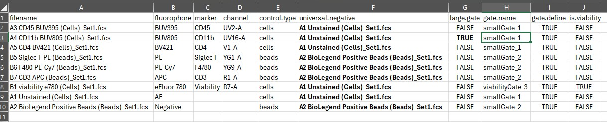
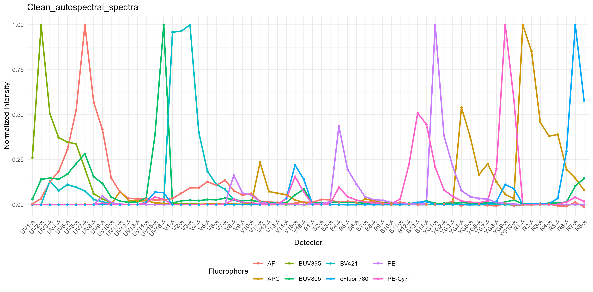
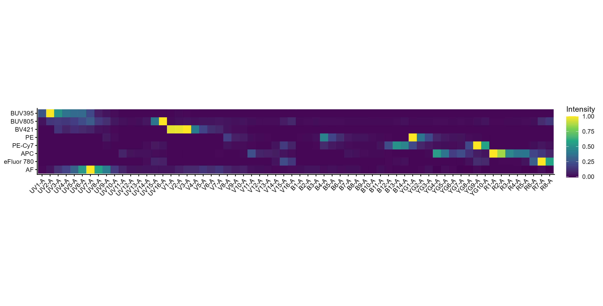
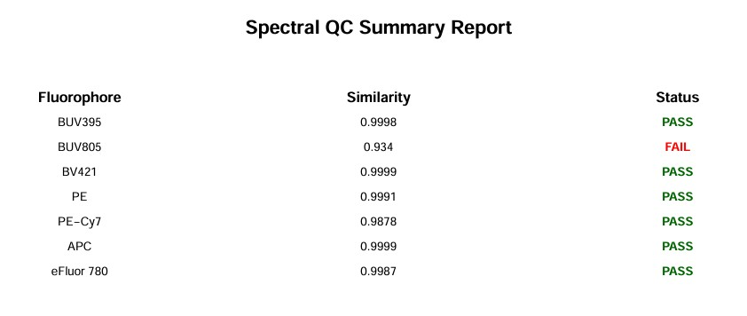
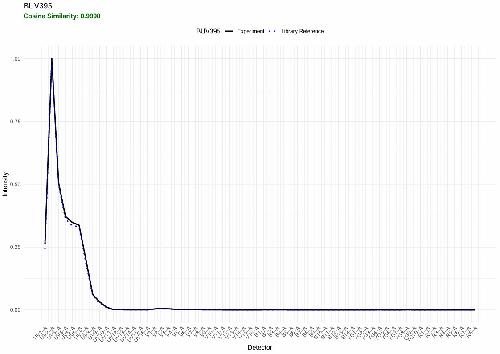
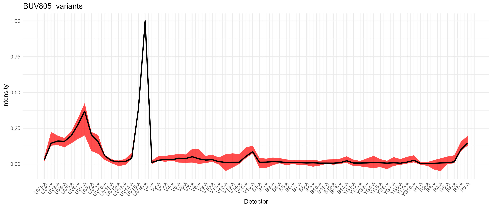
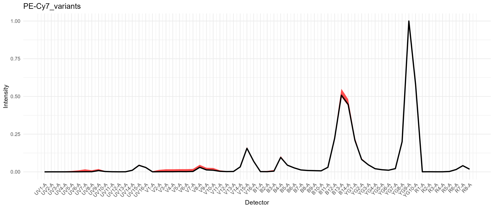
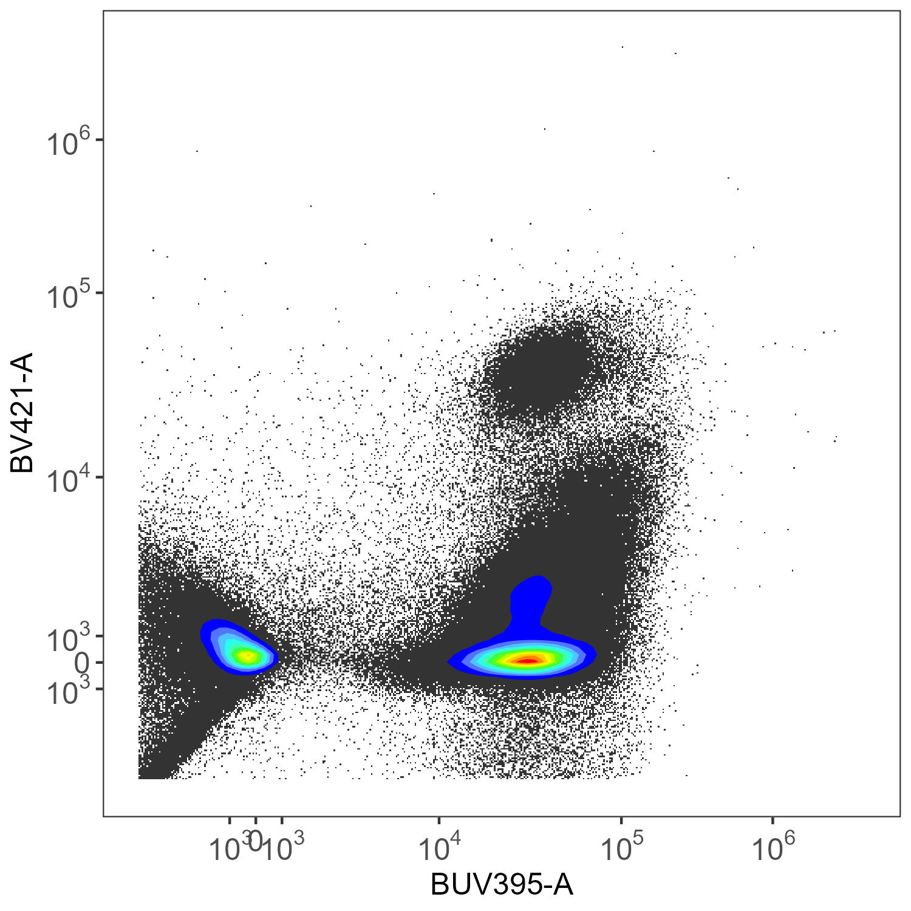
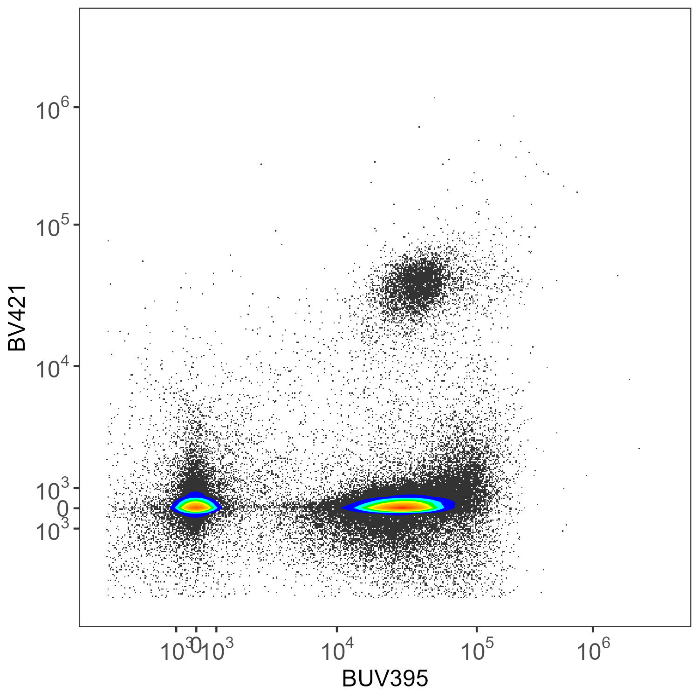

# 01 Automated Spectral Workflow

## Installation

If you need to install AutoSpectral, run this bit first:

``` r

# Install Bioconductor packages
if (!requireNamespace("BiocManager", quietly = TRUE))
  install.packages("BiocManager")
BiocManager::install(c("flowWorkspace", "FlowSOM"))

# You'll need devtools or remotes to install from GitHub.
install.packages("remotes")
remotes::install_github("DrCytometer/AutoSpectral")
```

For significantly faster processing, we also recommend installing the
companion C++ acceleration package. This is optional but has a
meaningful effect on runtime, particularly for the automated spectral
extraction and per-cell autofluorescence steps. On Windows, install
[Rtools](https://cran.r-project.org/bin/windows/Rtools/) first.

``` r

remotes::install_github("DrCytometer/AutoSpectralRcpp")
```

Once installed, `AutoSpectralRcpp` is used automatically wherever it
helps — no further action is needed.

## Get the data

Download the data for today’s example from [Mendeley
Data](https://data.mendeley.com/datasets/ch5dnspd79/1).

These data are a 7-colour panel run on a 5-laser Cytek Aurora. The
samples are from spleen, lung and liver. This is a pretty simple
experiment, which is nice since it will run quickly. The different
tissues allow us to look at how to handle diverse autofluorescence
profiles. I’ll point out that this panel has been deliberately designed
to accommodate autofluorescence peaks, so we can expect autofluorescence
removal to work pretty well with any method.

## Start-up

Now we can load AutoSpectral.

``` r

library(AutoSpectral)
```

## Getting your fluorophore spectra from the controls

### Creating the Control File

Since the default cytometer is the Aurora, we can actually just call
this without any arguments. Otherwise you need to specify the cytometer
you’re using.

``` r

asp <- get.autospectral.param(
  cytometer = "aurora",
  figures = TRUE # plot figures throughout to show what's going on
)
```

Where are the controls? This must be typed correctly.

``` r

control.dir <- "./Raw/Set1/Reference Group"
```

Create the control file. You will need to manually edit your control
file, telling AutoSpectral what’s going on. It will try to fill in some
stuff for you, but you should check this. See the article on this on
[GitHub](https://drcytometer.github.io/AutoSpectral/articles/02_Control_File_example.html)
or [Colibri
Cytometry](https://www.colibri-cytometry.com/post/autospectral-creating-the-control-file).

``` r

create.control.file(control.dir, asp)
```

We get warnings because I’ve got both bead and cell controls, and
AutoSpectral would like me to pick one per fluorophore. It’s better to
have only one control per fluorophore because we’ll use the spectral
profiles matrix for unmixing, and if you have two instances of the same
thing, that will create a big mess.

Here’s what the control file looks like as first generated: 

Fill in or verify the `marker`, `fluorophore`, `control.type`, and
`universal.negative` columns as appropriate. For more detail, see the
[Control File
article](https://drcytometer.github.io/AutoSpectral/articles/02_Control_File_example.html).

In the automated workflow you do **not** need to fill in `gate.name` or
`gate.define`. Those columns are only used by the legacy gating
pipeline. The `channel` column for the peak emission channel (or one
that receives a lot of signal) is also optional in the automated
pipeline. The peak channel will be automatically determined from the
data.

Here’s what a completed control file should look like for this workflow:


Once you’ve got it the way you want, write in the name of the control
file and run the error checking function.

``` r

control.file <- "fcs_control_file.csv"
check.control.file(control.dir, control.file, asp)
```

This will either tell you it didn’t find any issues, or, more likely,
provide you with a table of potential issues to consider fixing. Items
listed as warnings will not prevent the pipeline from running, but may
reduce the accuracy of the spectra generated and are things for you to
check. For instance, AutoSpectral will check how many events you have in
each of your control files and will raise a flag if you don’t have at
least 5000 events. See the help using
[`?check.control.file`](https://drcytometer.github.io/AutoSpectral/reference/check.control.file.md).

### Automated Spectral Extraction

The automated workflow replaces the three-step legacy pipeline
(`define.flow.control` → `clean.controls` → `get.fluorophore.spectra`)
with a single call:

``` r

spectra <- get.spectra.automated(
  control.dir     = control.dir,
  control.def.file = control.file,
  asp             = asp
)
```

Under the hood,
[`get.spectra.automated()`](https://drcytometer.github.io/AutoSpectral/reference/get.spectra.automated.md)
performs several in-place cleaning steps automatically, without
requiring you to define or tune any gates:

1.  **Saturation removal** — detector-saturated events are excluded
    before any per-fluorophore processing begins.
2.  **Singlet gating** — doublets are automatically excluded.
3.  **AF orthogonalisation** — for each single-stained control, the
    autofluorescence vector (from the paired `universal.negative`
    specified in your control file, or estimated internally from the
    lower quartile of the control itself) is projected out to identify
    events whose signal is genuinely driven by the fluorophore rather
    than background.
4.  **Cosine-similarity filtering** — top-expressing candidate events
    are ranked by their cosine similarity to the AF vector. Events that
    are too AF-like are excluded, retaining only the most
    fluorophore-rich subset.
5.  **KNN scatter-matched AF subtraction** — for each retained event,
    the nearest-neighbour unstained events in scatter space are averaged
    and subtracted, giving a per-event background-corrected spectral
    signature.
6.  **Automated QC with legacy pipeline fallback** — the resulting
    spectrum is compared against the spectral reference library (via
    cosine similarity). If the similarity is below the default
    threshold, the function automatically re-runs that particular
    control using the original AutoSpectral pipeline with control
    cleaning and robust linear modelling along the expected peak channel
    rather than reporting a failure. If the legacy approach produces a
    spectrum more like the reference spectrum, that one is kept. In the
    event of a fallback check, both versions of the spectrum are saved
    for you to inspect.

The default settings work well across a wide range of panels, but the
key parameters can be adjusted if needed:

``` r

spectra <- get.spectra.automated(
  control.dir           = control.dir,
  control.def.file      = control.file,
  asp                   = asp,
  n.candidates          = 1000L,   # candidate events selected per fluorophore
  n.spectral            = 200L,    # events retained after cosine filtering
  k.neighbors           = 2L,      # scatter neighbours for AF subtraction
  cosine.threshold      = 0.9,     # min cosine vs reference library
  peak.signal.threshold = 0.5      # min normalised signal in expected peak channel
)
```

#### Outputs

When `figures = TRUE` (the default),
[`get.spectra.automated()`](https://drcytometer.github.io/AutoSpectral/reference/get.spectra.automated.md)
produces several diagnostic outputs:

**Spectral traces and heatmap** — the same standard outputs as the
legacy pipeline. Check these against the expected profiles for your
cytometer in online viewers such as [Cytek
Cloud](https://cloud.cytekbio.com/) or in the QC plots.



Spectral Signature Traces



Spectral Signature Heatmap

**Cosine similarity heatmap** — shows pairwise similarity between all
fluorophore spectra.


Cosine Similarity Heatmap

**Hotspot matrix** — highlights fluorophore pairs with high spectral
overlap, as in Mage et al. Values above 6 are most likely to cause
unmixing problems; values between 4 and 6 are worth reviewing.


Hotspot Matrix Heatmap

**Per-fluorophore cosine-filter traces** (`figure_cosine_filter/`) — a
multi-panel PDF showing, for each control, how events are distributed by
their cosine similarity to the AF vector. Events are coloured from least
to most AF-like, and the retained subset is highlighted. This is useful
for diagnosing controls where the AF and fluorophore signals are hard to
separate.

**Scatter-match plots** (`figure_scatter_match/`) — a multi-panel PDF
showing, for each fluorophore, the unstained background population, the
selected spectral events, and the matched AF events used for
subtraction. Inspect these to confirm the pairing is sensible for each
control.

**Spectral QC report** (`figure_spectral_ribbon/`) — a per-fluorophore
PDF comparing the extracted spectrum against the reference library entry
for that instrument. Fluorophores that triggered the RLM fallback are
flagged, and both the automated and refined spectra are shown where
applicable.



Spectral QC Report



Spectral QC BUV395

**Spectra CSV** — the final normalised spectra matrix is saved to
`table_spectra/`. You can reload it later using
[`read.spectra()`](https://drcytometer.github.io/AutoSpectral/reference/read.spectra.md)
and pass it directly to any unmixing function. Call
`list.files("table_spectra/")` to find all the files in that folder.

We also need a minimal `flow.control` object for feeding in the dye and
marker names during unmixing. In the automated workflow, this is created
using the
[`reload.flow.control()`](https://drcytometer.github.io/AutoSpectral/reference/reload.flow.control.md)
tool:

``` r

flow.control <- reload.flow.control(
  control.dir      = control.dir,
  control.def.file = control.file,
  asp              = asp
)
```

## Unmixing

AutoSpectral provides options for unmixing. Let’s start with the most
basic, which is replicating the OLS unmixing as in SpectroFlo.
Autofluorescence extraction with OLS and WLS unmixing in AutoSpectral is
handled by including an “AF” signature in `spectra`. This is generated
automatically from the unstained cell control sample that is tagged as
“AF” in your `control.file`. We can use OLS or WLS without
autofluorescence extraction by removing this row from the `spectra`
matrix before we pass it to the unmixing call. Here are two easy ways to
do that:

1.  subset `spectra`
2.  read in the CSV file in `table_spectra`, removing the AF channel

``` r

rownames(spectra)
no.af.spectra <- spectra[ !(rownames(spectra) == "AF"),]
rownames(no.af.spectra)
no.af.spectra.2 <- read.spectra("Clean_autospectral_spectra.csv",
                                remove.af = TRUE)
rownames(no.af.spectra.2)
```

To unmix, specify the file (and path) of the FCS file you want to unmix:

``` r

spleen.fcs.file <- "./Raw/Set1/Stained/D4 Spleen_Set1.fcs"
unmix.fcs(
  spleen.fcs.file,
  spectra, asp,
  flow.control,
  method = "OLS",
  file.suffix = "with AF extraction"
)
unmix.fcs(
  spleen.fcs.file,
  no.af.spectra,
  asp,
  flow.control,
  method = "OLS",
  file.suffix = "without AF extraction"
)
```

Note that this is just using OLS–this is not the “AutoSpectral” unmixing
method, we are just using the AutoSpectral R package to perform bog
standard unmixing.

If we have a folder full of FCS files, we can do all the files in the
folder. Note that this is essentially just an `lapply` loop over the
files. It can, however, be parallelized (set `parallel=TRUE`). Memory
usage is handled via file chunking, which you can modify using the
`chunk.size` argument, if needed.

``` r

unmix.folder(
  fcs.dir = "./Raw/Set1/Stained/",
  spectra = spectra,
  asp = asp,
  flow.control = flow.control,
  method = "OLS", # use OLS unmixing (not AutoSpectral unmixing)
  parallel = TRUE,
  threads = 3
)
```

By default, the unmixed files are generated in `Autospectral_unmixed`,
but you can change that by passing a path to `output.dir`.

If we want to use weighted least-squares, we call like this:

``` r

unmix.fcs(spleen.fcs.file, spectra, asp, flow.control, method = "WLS")
```

The `method` is automatically appended to the output file name. If you
wish to add something else to the file name, use the `file.suffix`
argument.

More details on WLS unmixing, including calculating and re-using weights
are detailed in [dedicated
article](https://drcytometer.github.io/AutoSpectral/articles/18_Weighted_Least_Squares.html)

Okay, that’s basic unmixing. And, I think you should see a bit of
improvement using AutoSpectral even with the same unmixing algorithms
due to the improvements in single-colour control handling. We do.

## Per-cell unmixing

### Per-cell Autofluorescence Extraction

For per-cell autofluorescence extraction and per-cell fluorophore
optimization, AutoSpectral needs more information. We will extract
autofluorescence signatures from the three tissues involved here, and
look at how to use those in the unmixing. We’ll also get information
about the fluorophore emission variability and use that to try to
improve the unmixing.

When we go to use this information in the unmixing, we select
`method = AutoSpectral`.

Per-cell autofluorescence extraction is substantially faster with
`AutoSpectralRcpp` installed (see the Installation section above). Once
installed, it takes over automatically — no further action is needed.

To use per-cell autofluorescence extraction only, no fluorophore
optimization, do this:

``` r

spleen.unstained <- "./Raw/Set1/Unstained/D1 Spleen_Set1.fcs"
spleen.af <- get.af.spectra(
  unstained.sample = spleen.unstained,
  asp = asp,
  spectra = spectra,
  refine = TRUE # optional; when TRUE, more AF spectra will be generated, focusing on problem cells. This takes longer, though.
)
unmix.fcs(
  fcs.file = spleen.fcs.file,
  spectra = spectra,
  asp = asp,
  flow.control = flow.control,
  method = "AutoSpectral", # use AutoSpectral unmixing
  af.spectra = spleen.af, # use these AF signatures as the options
  file.suffix = "per-cell AF extraction"
)
```

Using `refine=TRUE` will take longer, both during the
[`get.af.spectra()`](https://drcytometer.github.io/AutoSpectral/reference/get.af.spectra.md)
call and during subsequent unmixing calls. The benefit of this is
primarily in messier samples, particularly those from tissues. If you
are just using PBMCs or nice lymphoid samples like spleen, you probably
won’t see much benefit from this.

We get the distribution of autofluorescence spectra as a spectral trace
and as a heatmap in `figure_autofluorescence`. The AF spectra are saved
as a CSV file in `table_spectra`.


Autofluorescence profiles in the spleen

We can also look at the distribution of autofluorescence like this,
where the black line represents a median signature (what you might use
with an automated single AF parameter), and the red region represents
the variation:


Autofluorescence variation in the spleen

We also get images showing us the impact of the AF extraction on the
unstained sample we have supplied.

This is without any AF extraction, looking at what AutoSpectral has
determined are the two most-affected fluorophore channels:


Spleen: No AF Extraction

What you get on the same unstained sample with per-cell AF extraction,
without refinement (refine=FALSE):


Spleen: Per-Cell AF Extraction

What you get on the same unstained sample with per-cell AF extraction,
*with* refinement (refine=TRUE):


Spleen: Per-Cell AF Extraction Refined

If you want to do this with samples containing different
autofluorescence profiles, such as we have here, we extract the AF
spectral variation from each type of unstained sample. We then provide
the corresponding `af.spectra` to each unmixing call. The unmixing call
can be to a single FCS file, or it can be, as above, to a folder. So, if
you have a whole set of stained lung samples, you’d pull your AF spectra
from the unstained lung sample, and then call `unmix.folder` on the
folder containing your lung (and only lung) samples. Repeat for each
type of autofluorescence sample. Read more about how the per-cell
autofluorescence extraction works in the
[GitHub](https://drcytometer.github.io/AutoSpectral/articles/10_Single_Cell_AutoFluorescence.html)
or
[Colibri](https://www.colibri-cytometry.com/post/autospectral-single-cell-autofluorescence)
article.

In this case, we have three types of samples: spleen, liver and lung
tissues. If you are working with human PBMCs, usually a single
(optionally pooled) unstained PBMC sample is fine. If, however, you have
samples from very sick donors, you might consider collecting unstained
sample from each donor and matching the autofluorescence more closely.

``` r

lung.unstained <- "./Raw/Set1/Unstained/D2 Lung_Set1.fcs"
lung.af <- get.af.spectra(lung.unstained, asp, spectra) # use refine=TRUE for a modest improvement, default is FALSE
lung.fcs.file <- "./Raw/Set1/Stained/D5 Lung_Set1.fcs"
unmix.fcs(
  lung.fcs.file,
  spectra,
  asp,
  flow.control,
  method = "AutoSpectral",
  af.spectra = lung.af,
  file.suffix = "per-cell AF extraction"
)

liver.unstained <- "./Raw/Set1/Unstained/D3 Liver_Set1.fcs"
liver.af <- get.af.spectra(liver.unstained, asp, spectra) # use refine=TRUE for a modest improvement, default is FALSE
liver.fcs.file <- "./Raw/Set1/Stained/D6 Liver_Set1.fcs"
unmix.fcs(
  liver.fcs.file,
  spectra,
  asp,
  flow.control,
  method = "AutoSpectral",
  af.spectra = liver.af,
  file.suffix = "per-cell AF extraction"
)
```

You can easily set this up as a for loop or an lapply loop matching
elements by names from a list.

For more detail on the per-cell AF extraction, see the [dedicated
article](https://drcytometer.github.io/AutoSpectral/articles/10_Single_Cell_AutoFluorescence.html)
on this subject.

### Per-cell Fluorophore Optimization

To do per-cell fluorophore optimization, we will first measure the
variation in the spectrum for each fluorophore. For the unmixing, we’ll
supply the `af.spectra` and the `spectra.variants`, calling
`AutoSpectral` unmixing. Read more about how the per-cell fluorophore
optimization works in the
[GitHub](https://drcytometer.github.io/AutoSpectral/articles/11_Per_Cell_Optimization.html)
or
[Colibri](https://www.colibri-cytometry.com/post/autospectral-per-cell-fluorophore-optimization)
article.

We provide `spleen.af` as the `af.spectra` here because the control
samples are from spleen. Provide whatever is the best fit for your
single-stained controls. The point here is to match the AF of the
controls so that we isolate the variation in the fluorophore signatures
independent of any AF variation.

``` r

variants <- get.spectral.variants(
  control.dir = control.dir,
  control.def.file = control.file,
  asp = asp,
  spectra = spectra,
  af.spectra = spleen.af, # the AF relevant to any cell-based single-stained controls
  parallel = FALSE, # use parallel if TRUE
  refine = TRUE # optional; when TRUE, the variation will focus on more problematic cells--those that remain far from the ideal location after a first pass
)
```

The output of this is saved as an RDS file in folder
`figure_spectral_variants`. You can load it back in using the
[`readRDS()`](https://rdrr.io/r/base/readRDS.html) function in base R.

There are plots of the spectral variation for each fluorophore. For
something like the CD11b-BUV805 in this data, the variation is largely
changes in the autofluorescence because there are multiple cell types
expressing CD11b. We also have variation in the long wavelength
spillover on the violet and red laser, as should be expected from a
tandem dye.



Variation in BUV805

For PE-Cy7, we get a modest difference in the excitation between the
blue and yellow-green lasers, which would cause spread if we had a
fluorophore in that range on the blue laser, such as RB780. We don’t in
this case.

If we had tandem breakdown, we would probably see variability in the
YG1-A detector.



Variation in PE-Cy7

We can now pass this to the unmixing call. For quicker results, you may
set the `speed` to `fast`, which checks fewer pre-screened variants per
cell.

``` r

unmix.fcs(
  lung.fcs.file,
  spectra,
  asp,
  flow.control,
  method = "AutoSpectral", # use AutoSpectral unmixing
  af.spectra = lung.af, # use this set of AF (matched to sample source)
  spectra.variants = variants, # by providing variants, we instruct the unmixing to perform per-cell fluorophore optimization
  file.suffix = "per-cell AF and fluorophore optimization",
  speed = "slow", # slow will be a bit better
  parallel = TRUE
)
```

Please note that if you are comparing the output FCS files from
AutoSpectral to others you may have from the cytometer and you are doing
this in FlowJo, FlowJo V10 is still terrible at handling scales. You
must set the transformations on the axes to be the same for all
coefficients in order to do a fair comparison. Otherwise you’ll see
whatever you’ve already done to tune your display (e.g., biexponential
width basis) for your existing files versus some random default
selection by FlowJo for AutoSpectral’s files. Nothing to do with me.

For more detail on the per-cell fluorophore optimization, see the
[dedicated
article](https://drcytometer.github.io/AutoSpectral/articles/11_Per_Cell_Optimization.html)
on this subject.

## Plotting

You can do a comparison using the plotting functions in AutoSpectral,
but a dedicated flow cytometry analysis program with a graphical
interface will be better. More on plotting on the dedicated article on
[GitHub](https://drcytometer.github.io/AutoSpectral/articles/13_Plotting.html)
or
[Colibri](https://www.colibri-cytometry.com/post/autospectral-plotting).

``` r

autospectral.unmixed.lung <- "AutoSpectral_unmixed/D5 Lung_Set1 AutoSpectral per-cell AF and fluorophore optimization.fcs"
spectroflo.unmixed.lung <- "./Unmixed/Set1/Stained/D5 Lung_Set1.fcs"

# using native AutoSpectral reader here (see `flowstate`)
asp.lung <- AutoSpectral::readFCS(autospectral.unmixed.lung)
sf.lung <- AutoSpectral::readFCS(spectroflo.unmixed.lung)

create.biplot(sf.lung, "BUV395-A", "BV421-A", asp, title = "SpectroFlo")
create.biplot(asp.lung, "BUV395-A", "BV421-A", asp, title = "AutoSpectral")
```

Let’s have a look at the unmixed data.



SpectroFlo Unmixed



AutoSpectral Unmixed

Here we have CD45-BUV395 and CD4-BV421. There really shouldn’t be much
of anything low for CD4 in the mouse. This is ungated data, so we’re
seeing everything, without any clean-up.

The original unmixing only uses a single autofluorescence parameter. As
mentioned at the beginning of this post, you can use multiple
autofluorescence to achieve better results in SpectroFlo with this small
panel as it has been designed to accommodate that. There is no one
solution for that approach, though.

Also, the plots shown here have hard cut-offs on the x and y axes,
determined by arguments to create.biplot(). That can be modified, of
course, but as stated, you’re better off doing that in dedicated flow
analysis software.
