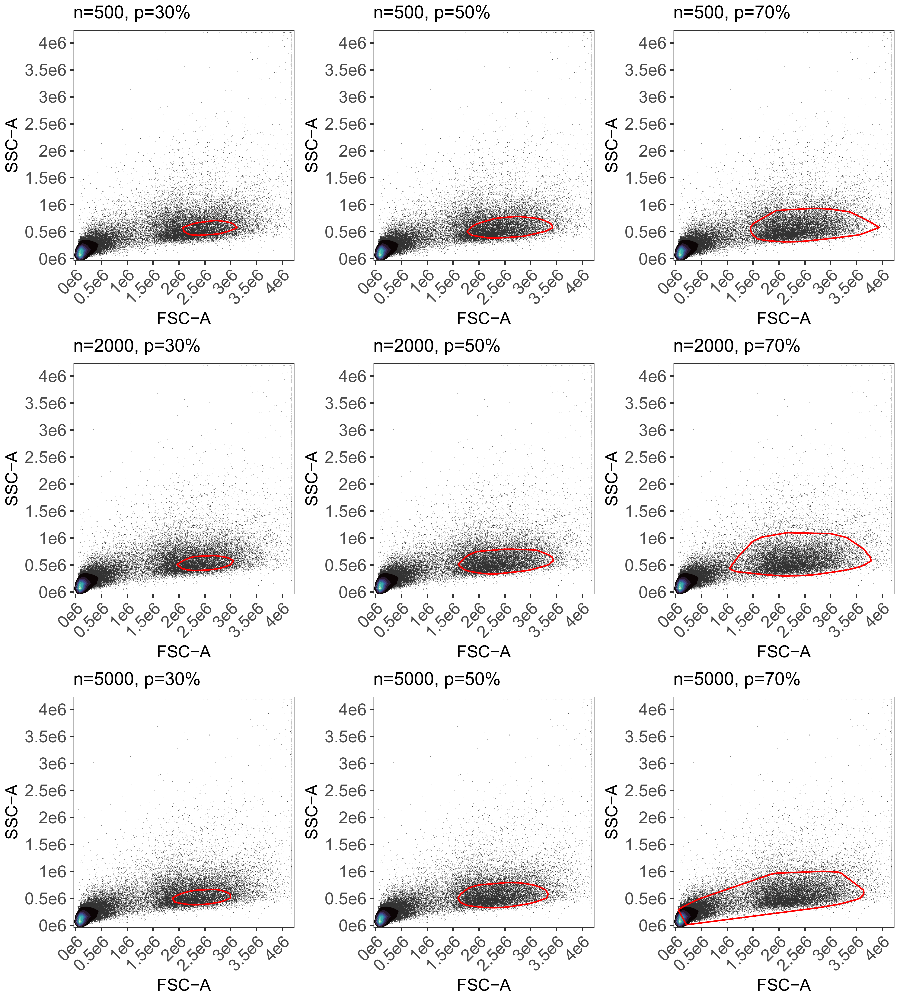

# 07 Controlled Gating: Landmarks and Tuning

## Tuning your gates

In previous articles, we explored the default automated density-based
gating. While effective for simple samples, complex datasets with
multiple control types or non-leukocyte cell sources often require more
control.

AutoSpectral 1.5.0 introduces a “Landmarks” gating system and a suite of
tuning tools. This article covers how to use tune.gate(),
define.gate.landmarks(), and define.gate.density() to pre-define your
gates before processing your experiment with define.flow.control().

### 1. Preparing the Control File

To use these advanced functions, your control.def.file (the CSV defining
your samples) needs two specific columns:

gate.name: A label for the gate (e.g., “lymphocytes”, “monocytes”, or
“beads”).

gate.define: A logical (TRUE/FALSE) indicating which file(s) should be
used to calculate the gate boundary.

For example, to define a lymphocyte gate using a CD4-PE control, you
would set gate.name = “lymphocyte” and gate.define = TRUE for that row.

### 2. Tuning your Gates with tune.gate()

Before committing to a final gate, tune.gate() allows you to test
multiple parameters simultaneously. It generates a grid of plots showing
how different n.cells and percentiles affect the resulting boundary.

``` r

library(AutoSpectral)
asp <- get.autospectral.param(cytometer = "id7000")

# Test 3 different cell counts and 3 density percentiles
tune.gate(
  control.file = "fcs_control_file.csv",
  control.dir = "path/to/fcs",
  asp = asp,
  n.cells = c(100, 500, 2000),
  percentiles = c(30, 50, 70),
  gate.name = "lymphocyte"
)
```

This will save a combined plot to ./figure_gate_tuning, helping you
visually pick the best settings.

In the example below, we’re using different numbers of cells and
different percentile cutoffs to try to establish a good boundary for the
lymphocyte population. This is being done using the Landmarks system,
with markers expressed in lymphocytes. Any of the 500/70, 2000/70 or
5000/50 would probably be fine for me.



Example of gate tuning

### 3. Defining Gates: Landmarks vs. Density

Once you know your preferred parameters, you can generate a formal gate
object using one of two methods:

#### Method A: define.gate.landmarks() (Recommended)

This method is highly robust for cell samples. It identifies the
brightest events in the peak channel (e.g., the CD4+ population) and
uses only those events to find the scatter “landmark” for your gate.

``` r

gate.lymph <- define.gate.landmarks(
  control.file = "fcs_control_file.csv",
  control.dir = "path/to/fcs",
  asp = asp,
  n.cells = 500,
  percentile = 70,
  gate.name = "lymphocyte"
)
```

#### Method B: define.gate.density()

This uses the original AutoSpill-style logic, searching for the densest
region in the scatter plot. It works well with beads and may be best for
samples where fluorescence “landmarks” aren’t available.

``` r

gate.beads <- define.gate.density(
  control.file = "fcs_control_file.csv",
  control.dir = "path/to/fcs",
  asp = asp,
  gate.name = "beads"
)
```

With both of these methods and the updated define.flow.control(), you
now get .rds files that save the gates. One of these saves the gate
boundary (called gate_definition, plus whatever you’ve named it), and if
you read this back into R using readRDS(), the gate can be supplied to
define.flow.control(). This will allow you to recycle gates between
experiments, if appropriate. You also get an .rds file that saves the
gating parameters. So, if you’ve gone to a bunch of work using
tune.gate(), but your next experiment may be slightly different, you can
start by loading in the gating parameters rather than the gate itself.
Hope that helps!

### 4. Passing Gates to define.flow.control()

The final step is to pass your pre-defined gates to the main experiment
setup function. You provide them as a named list via the gate.list
argument. Ensure the names in your list match the gate.name values in
your CSV. In this example, the control file would need to have
“lymphocyte” or “beads” in the gate.name column for each sample.

Any number of gates may be used if you pre-supply them.

``` r

# Combine your gates into a list
my.gates <- list("lymphocyte" = gate.lymph, "beads" = gate.beads)

# Run the experiment setup using your custom gates
flow.control <- define.flow.control(
  control.dir = "path/to/fcs",
  control.def.file = "fcs_control_file.csv",
  asp = asp,
  gate.list = my.gates
)
```

By pre-defining gates, you bypass the default automated search, ensuring
that AutoSpectral uses exactly the populations you intend for defining
the spectral signatures of your fluorophores from the single-stained
controls.
