```{r, include = FALSE}
knitr::opts_chunk$set(
  collapse = TRUE,
  comment = "#>"
)
```


# Installation

If you need to install AutoSpectral, run this bit first:
```{r install, eval=FALSE}
# Install Bioconductor packages
if (!requireNamespace("BiocManager", quietly = TRUE))
  install.packages("BiocManager")
BiocManager::install(c("flowWorkspace", "FlowSOM"))

# You'll need devtools or remotes to install from GitHub.
install.packages("remotes")
remotes::install_github("DrCytometer/AutoSpectral")
```

# Get the data

Download the data for today's example from [Mendeley Data](https://data.mendeley.com/datasets/ch5dnspd79/1).

These data are a 9-colour panel run on a 5-laser Cytek Aurora. The samples are from spleen, lung and liver. This is a pretty simple experiment, which is nice since it will run quickly. The different tissues allow us to look at how to handle diverse autofluorescence profiles. I'll point out that this panel has been deliberately designed to accommodate autofluorescence peaks, so we can expect autofluorescence removal to work pretty well with any method. In my testing, you can use multiple autofluorescences and get good results; you can also use deconvolution of the autofluorescence using principal components. Both produce good results with a highly over-determined data set like this. We'll look at the per-cell autofluorescence extraction with these data, which has the advantage of also working on large panels.

# Start-up

Now we can load AutoSpectral.
```{r setup, eval=FALSE}
library(AutoSpectral)
```

# Getting your fluorophore spectra from the controls

## Creating the Control File

Since the default cytometer is the Aurora, we can actually just call this without any arguments. Otherwise you need to specify the cytometer you're using.
```{r, eval=FALSE}
asp <- get.autospectral.param(
  cytometer = "aurora",
  figures = TRUE # plot figures throughout to show what's going on
)
```

Where are the controls? This must be typed correctly.
```{r, eval=FALSE}
control.dir <- "./Raw/Set1/Reference Group"
```


Create the control file. You will need to manually edit your control file, telling AutoSpectral what's going on. It will try to fill in some stuff for you, but you should check this. See the article on this on [GitHub](https://drcytometer.github.io/AutoSpectral/articles/02_Control_File_example.html) or [Colibri Cytometry](https://www.colibri-cytometry.com/post/autospectral-creating-the-control-file).

```{r, eval=FALSE}
create.control.file(control.dir, asp)
```

We get warnings because I've got both bead and cell controls, and AutoSpectral would like me to pick one per fluorophore. This isn't strictly necessary, so if you want to bypass this, just change the names in the "fluorophore" column of the control file to be unique names. For instance, you could have "PE cells" and "PE beads". Note, however, that whatever you put as the "fluorophore" is what gets written to the description of the channel in the FCS file later on. So, you'll be better off picking one control per fluorophore. If you have a situation like this, you can run the controls in different `flow.control` sets, figure out which you like best, and then do a final version with the best choices.

Here's what the control file looks like as first generated:
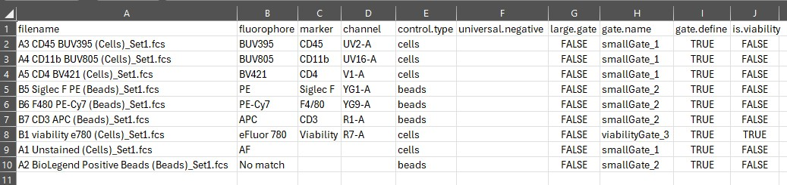

If AutoSpectral does not fill in the marker column, add your marker labels. To avail yourself of AutoSpectral's automation and get it to fill in the names of your markers automatically, include the marker name in the name of your single-stained FCS files. This should be separated from other elements of the filename by a space or an underscore. The marker also must be represented in the [marker database](https://docs.google.com/spreadsheets/d/16FAinR_Nfnl00mpHvmQFJT_uJJY3VUWk29yAaQ7HHn8/edit?usp=sharing), and the way you've written the marker must match one of the synonyms in the database. If your marker or the way you write it isn't in the marker database, please add it! Changes will be incorporated with the next update.

You do not have to use the marker names AutoSpectral provides. Write these however you want.

If AutoSpectral does not fill in the fluorophore column, add your fluorophore names. Also check to be sure that the names AutoSpectral has given you are correct--getting accurate matching of complex fluorophore names when people may write them very differently is difficult. It's especially difficult when the fluorophores may contain the same elements repeatedly, so we have to try to distinguish "PE", "PERCP", "PERCP-C5.5", "PERCP Cy5.5", etc.

You do not have to use the fluorophore names AutoSpectral provides, but you will lose out on the spectral QC if the names do not match the name in the database. This is not essential to achieve good unmixing.

If AutoSpectral does not fill in the control.type column, fill this in with either "beads" or "cells", as is appropriate for the sample on that line.

If AutoSpectral does not fill in the channel column, you will need to add this yourself. This is a bit harder. If you know this already, great. I suggest checking against the [cytometer database](https://docs.google.com/spreadsheets/d/1wj7QPkgpsuPNeVKyt-WWdBu5R48aZTgEbH8-_bpKeBY/edit?usp=sharing). to be sure you write the channel name correctly. If you do not know it, the best way to find out is usually to look at one of the cloud spectral viewer tools for this, such as [Cytek Cloud](https://cloud.cytekbio.com/), [BD Spectrum Viewer](https://www.bdbiosciences.com/en-us/resources/bd-spectrum-viewer), [BioLegend Spectra Analyzer](https://www.biolegend.com/en-gb/spectra-analyzer) or [FluoroFinder](https://fluorofinder.com/). Please note that the channel names in FluoroFinder do not always match what the names actually are in the instrument, so while you can use that figure out more or less where the fluorophore has its peak emission, be sure to use the names from the cytometer database for AutoSpectral.

To avail yourself of AutoSpectral's automation and get it to fill in the names of your fluorophores automatically, include the fluorophore name in the name of your single-stained FCS files. You may alter the names of the single-stained FCS files manually prior to running `create.control.file()` to do this (I would always advise creating a back-up copy before altering data or metadata). For the fluorophore names to be recognized by AutoSpectral, they need to be separate from other elements in the file name by a space or an underscore "_". They also need to be in the [fluorophore database](https://docs.google.com/spreadsheets/d/14j4lAQ6dkjDBKMborDv_MkSptyNBqZiBsq5jNNSCoiQ/edit?usp=sharing), and have a synonym in one of the columns that matches the way you have written the fluorophore in your FCS filename. If your fluorophore or the way you write it isn't in the marker database, please add it! Changes will be incorporated with the next update.

It is always recommended to use a universal negative (a separate unstained sample), whether you are using AutoSpectral or any other unmixing platform. To specify which sample is the universal.negative for each single-stained control, copy and paste the relevant filename into the universal.negative column. The negative sample for a given stained sample should be the same type of particles (cells or beads), and should really be the same thing, just unstained. A universal.negative (unstained) sample is its own universal negative.

Here's what we want it to look like, in terms of assigning universal negatives and setting fluorophore names. We'll get to the gating in a moment.


For more on this, see the [Control File article](https://drcytometer.github.io/AutoSpectral/articles/02_Control_File_example.html).

Once you've got it the way you want, write in the name of the control file and run the error checking function.
```{r, eval=FALSE}
control.file <- "fcs_control_file.csv"
check.control.file(control.dir, control.file, asp)
```

This will either tell you it didn't find any issues, or, more likely, provide you with a table of potential issues to consider fixing. Items listed as warnings will not prevent the pipeline from running, but may reduce the accuracy of the spectra generated and are things for you to check. For instance, AutoSpectral will check how many events you have in each of your control files and will raise a flag if you don't have at least 5000 events. The threshold to trigger this particular warning can be adjusted using the `min.event.warning` argument. See the help using `?check.control.file`.

## Gating

Once, the control file passes the error checks, we can create some gates. This can be done in full automatic mode, and if you wish to try that, jump to the next section: "Loading the Data". As of version 1.5.0, however, there is more control over the gating process, which is covered in this section.

Gating allows us to identify which events in the file are actually our cells, as opposed to debris, doublets or other stuff. While you can directly proceed to loading in all of the data by calling `define.flow.control()`, which automatically defines gates as best it can, taking a moment to check that the gates are correct prior to doing this will work more consistently.

The first step here is to consider which samples should share the same gates. AutoSpectral will try to help you with this when creating the control file, at least if you have version 1.5.0 or higher installed. It will create simple groupings of your samples based on the type of sample (beads vs cells) and whether the marker identifies dead cells. If AutoSpectral cannot identify the type of sample or any information about the markers from the file names, it will be unable to help here, and you must do this manually.

For this, we are going to be working with the control file. Let's take our example as it is currently. We have some controls that are beads, some that are cells, one that is a viability marker, and one cell control that we have marked as needing a larger gate because it is a myeloid population with higher expected side scatter values. We need at least four gates. We can call these whatever we want, but I'm going to pick somewhat informative names: "beads", "lymphocytes", "myeloid" and "dead". We add these names to the appropriate rows of our table in the `gate.name` column:
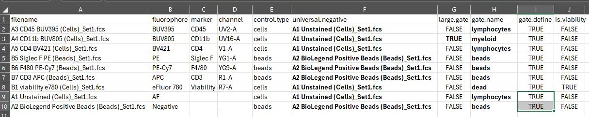

Now we can choose which samples we want to use to define the gate boundaries. The simplest option is to just use everything. To do this, put "TRUE" in every row of the `gate.define` column. This should be done by default in version 1.5.0 and higher (as shown here).

If you want to get fancier about it, you can choose which samples you use to define the gates. This can be helpful if some samples are "better" than others. It is particularly useful when using the "landmarks" gating system. This system finds the brightest positive events in the expected peak channel for the sample(s) and uses those to define the boundary. This means that you can use your anti-CD3 or anti-CD4-stained sample to define the boundary of the lymphocyte region based on where the CD3+ or CD4+ cells are. For today's example, we will use the landmark gating system. We can define one gate using our CD4-BV421 (cells) and apply it to the CD45 BUV395 (cells) as well for lymphocytes. We can define a second gate using our CD11b-BUV805 (cells) for the myeloid cells. We can define a third gate using our viability-e780 (cells) for dead cells, and we can define a fourth gate on all of the stained bead samples, which will all be in the same position since they are beads.

In order for the landmark approach to work, at least one sample used to define the gate must be stained (a single-stained control). Otherwise we don't have any landmarks to find. The density-based gating system does not have this limitation. However, you can create a landmark-based gate using one or more single-stained control files, and apply the resulting gate to one or more unstained samples. This is controlled using the `gate.define` and `gate.name` columns in the control file.

*Note*: I expect to provide a little more automated assistance in future version for filling in this part of the control file.

Now our control file looks like this:
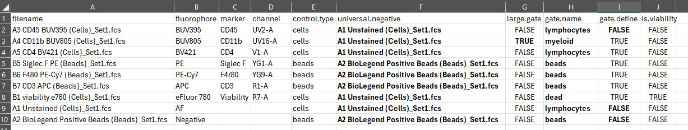


You can create any number of gates and pass them in the next step. Gates are saved and can be reused. See the dedicated articles on this for more information, including on how to use the `tune.gate()` function.

[Gating](https://drcytometer.github.io/AutoSpectral/articles/06_Gating.html)

[Density gating parameters](https://drcytometer.github.io/AutoSpectral/articles/07_Gating_Parameters_Density.html)

[Gate tuning](https://drcytometer.github.io/AutoSpectral/articles/08_Advanced_Gating.html)


Before proceeding, run the control file check to be sure that what you're doing with the gates is consistent with what AutoSpectral expects.


```{r, eval=FALSE}
check.control.file(control.dir, control.file, asp)
```

Assuming that passes with no errors, define the gates:
```{r, eval=FALSE}
gate.lymphocyte <- define.gate.landmarks(
  control.file = control.file,
  control.dir = control.dir,
  asp = asp,
  n.cells = 2000,
  percentile = 70,
  gate.name = "lymphocytes"
)
gate.meloid <- define.gate.landmarks(
  control.file = control.file,
  control.dir = control.dir,
  asp = asp,
  n.cells = 2000,
  percentile = 70,
  gate.name = "myeloid"
)
gate.dead <- define.gate.landmarks(
  control.file = control.file,
  control.dir = control.dir,
  asp = asp,
  n.cells = 2000,
  percentile = 70,
  gate.name = "dead"
)

# for beads, we'll use the density-based gating instead
gate.beads <- define.gate.density(
  control.file = control.file,
  control.dir = control.dir,
  asp = asp,
  gate.name = "beads",
  color.palette = "turbo", # pseudocolor heatmapping palette
  boundary.color = "darkgoldenrod" # what color is the gate edge?
)
```

Note that this can be simplified to an lapply loop, if desired. Also, defining the gates will proceed more quickly if you have AutoSpectralRcpp installed, as it will take over internally for the density calculations.

Be sure to check the gates that are generated in the `figure_gate` folder--do they look right? If not, go to the Gating articles on [GitHub](https://drcytometer.github.io/AutoSpectral/articles/06_Gating.html) or  [Colibri](https://www.colibri-cytometry.com/post/autospectral-gating) for tips on how fix it.

[Gating Parameters](https://drcytometer.github.io/AutoSpectral/articles/07_Gating_Parameters_Density.html)

[Gate Tuning](https://drcytometer.github.io/AutoSpectral/articles/08_Advanced_Gating.html)


```{r, echo=FALSE, fig.cap="Lymphocyte Gate", fig.align="center"}
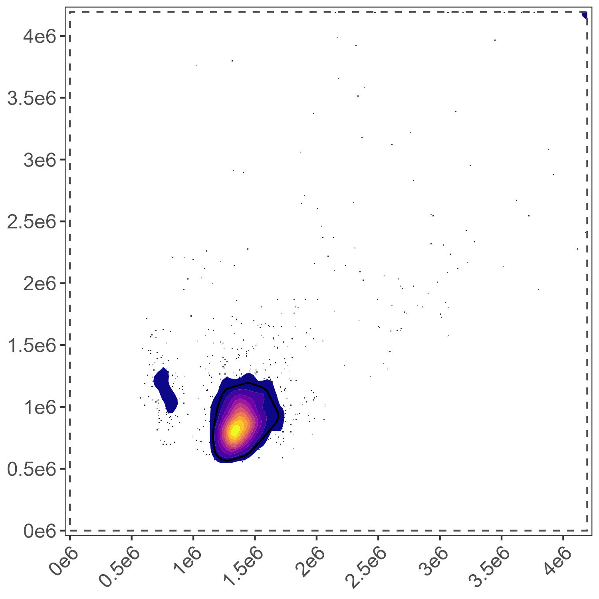
```

```{r, echo=FALSE, fig.cap="Myeloid Gate", fig.align="center"}
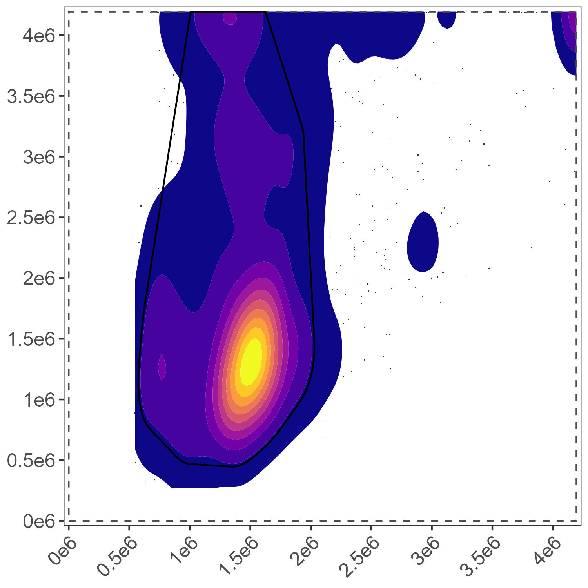
```

```{r, echo=FALSE, fig.cap="Dead Cell Gate", fig.align="center"}
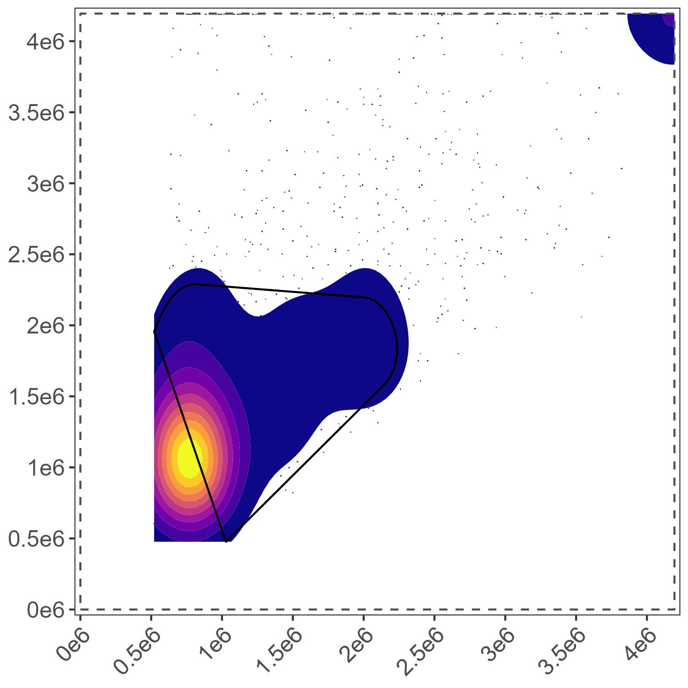
```

This one for the dead cells could probably do with some tuning.

```{r, echo=FALSE, fig.cap="Bead Gate", fig.align="center"}
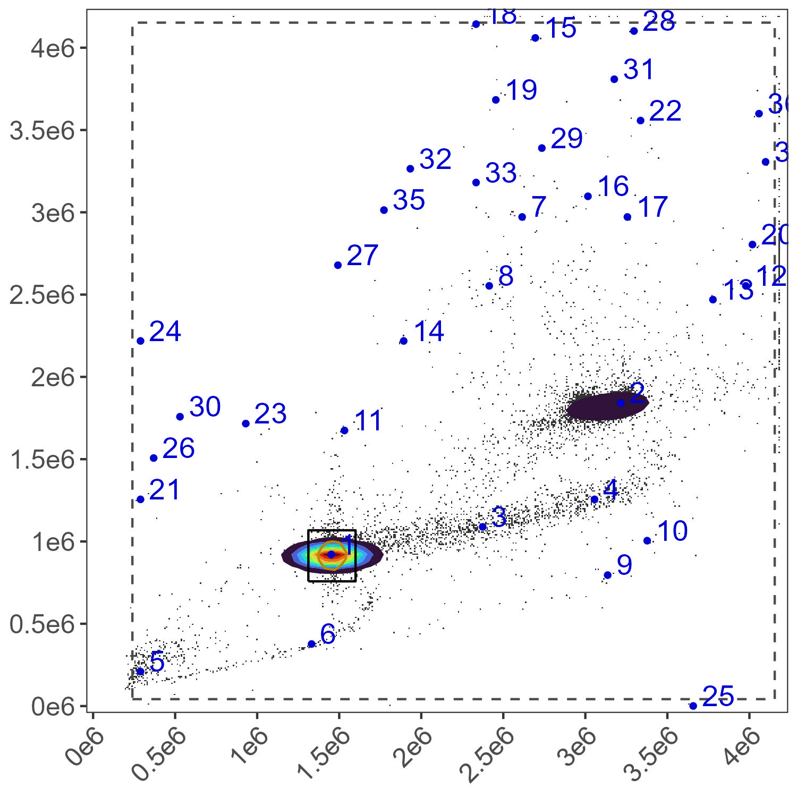
```

Let's adjust the dead cell gate quickly.

```{r, eval=FALSE}
tune.gate(
  control.file = control.file,
  control.dir = control.dir,
  asp = asp,
  n.cells = c(500, 2000, 5000),
  percentile = c(10, 50, 80),
  gate.name = "dead",
  color.palette = "mako",
  boundary.color = "red"
)
```

The results appear in folder figure_gate_tuning:

```{r, echo=FALSE, fig.cap="Dead cell gate tuning", fig.align="center"}
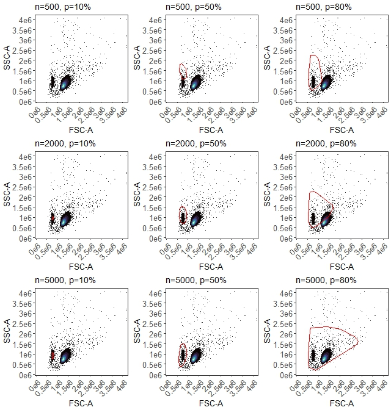
```


Now we have some options. We want a gate that includes the dead cells, which are the population on the lower left. We can pick the n=500, p=80% one, which pretty much only includes the dead cells, same for n=2000 p=50%, or something like the n=5000, p=80%, which includes the live cells as well. Any of those will end up in basically the same place in the end, provided we do the control cleaning. Our original gate would also have been fine, to be honest. I'm going to select n=5000, p=50%. To do that, we re-run the gate definition call:


```{r, eval=FALSE}
gate.dead <- define.gate.landmarks(
  control.file = control.file,
  control.dir = control.dir,
  asp = asp,
  n.cells = 5000,
  percentile = 50,
  gate.name = "dead",
  color.palette = "rainbow" # FlowJo-like colours
)
```


```{r, echo=FALSE, fig.cap="Dead Cell Gate Final", fig.align="center"}
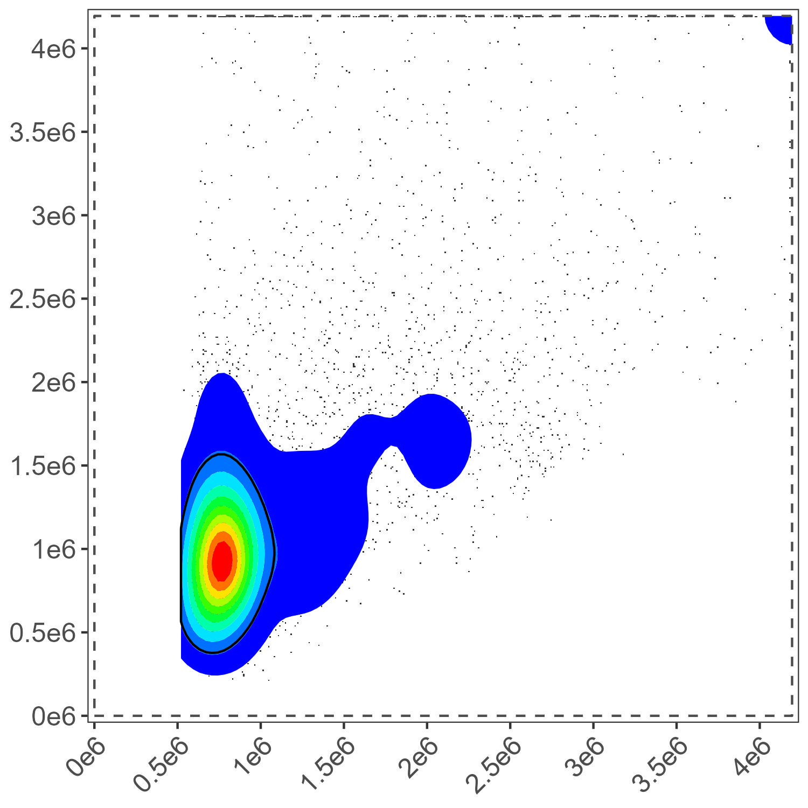
```


## Loading the Data

If everything looks okay with the gating, we proceed to load in all of the data, applying those gates to select the events we want.

```{r, eval=FALSE}
# Combine your gates into a list
my.gates <- list(
  "lymphocytes" = gate.lymphocyte,
  "myeloid" = gate.meloid,
  "dead" = gate.dead,
  "beads" = gate.beads
)

# Pass them to the function call
flow.control <- define.flow.control(
  control.dir = control.dir,
  control.def.file = control.file,
  asp = asp,
  gate.list = my.gates,
  color.palette = "rainbow" # optional: changes the plot color scheme
)
```

This will create a plot of each reference control sample with the intended gate applied to it. To see these, check the `figure_gate` folder.

For instance, here is the lymphocyte gate applied to the CD45 BUV395 sample:

```{r, echo=FALSE, fig.cap="CD45 BUV395 gating", fig.align="center"}
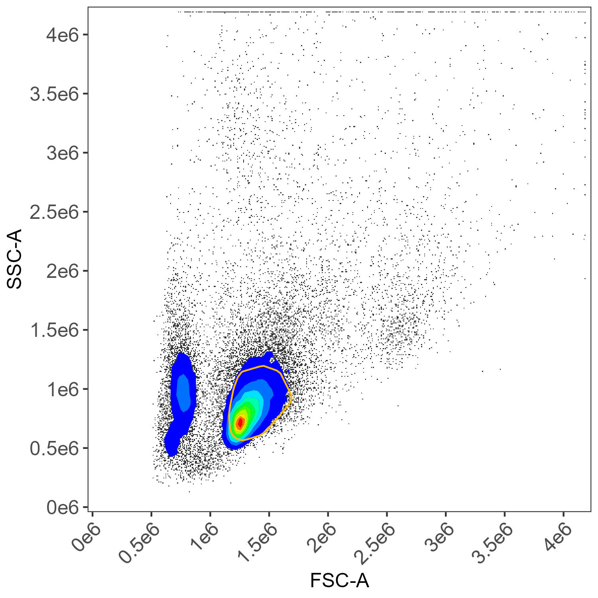
```

And we can also see that AutoSpectral has re-used the unstained cell sample to create matching negative samples with corresponding gates applied for the myeloid, dead cells and lymphocytes:


```{r, echo=FALSE, fig.cap="Unstained cells, lymphocyte gate", fig.align="center"}

```


```{r, echo=FALSE, fig.cap="Unstained cells, dead cell gate", fig.align="center"}

```


```{r, echo=FALSE, fig.cap="Unstained cells, myeloid gate", fig.align="center"}
knitr::include_graphics("figures/Workflow/AF_negative_myeloid.jpg")
```


## Control Cleaning

Now we can continue to control clean-up. This helps remove noisy events, like autofluorescence spikes, and tries to match the positive events for each control to corresponding cells/beads in the unstained `universal.negative` that you defined in the control.file.

The default settings here are usually best. See more on the cleaning article on [GitHub](https://drcytometer.github.io/AutoSpectral/articles/05_Cleaning.html) or [Colibri](https://www.colibri-cytometry.com/post/autospectral-cleaning). There is a parallelization option, which may be faster.

```{r, eval=FALSE}
flow.control <- clean.controls(flow.control, asp)
```
There are lots of plots generated with this, in `figure_clean_controls`, `figure_scatter` and in `figure_spectral_ribbon`.

For instance, here is a plot showing the matching that has been applied in terms of selecting cells with similar scatter profiles between the viability (live/dead) marker single-stained control and the unstained sample:


```{r, echo=FALSE, fig.cap="Scatter matching dead cells", fig.align="center"}
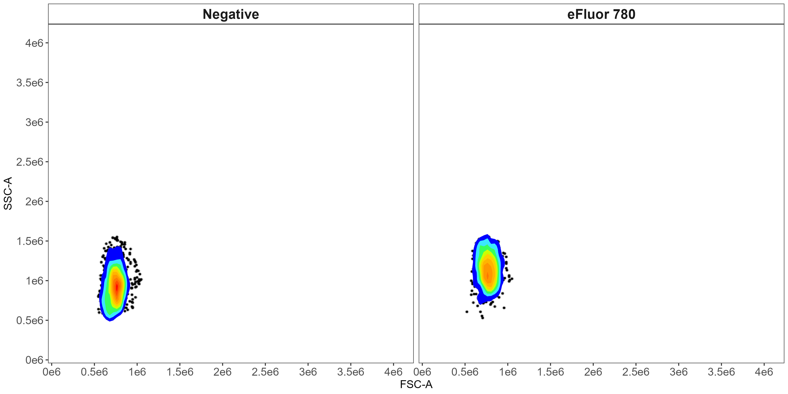
```

And here we have the attempt to gate out and exclude intrusive autofluorescence in the CD11b BUV805 single-stained control. BUV805 will peak in UV16-A on the Cytek Aurora, while autofluorescence often appear in UV7-A (although this is determined empirically and automatically by AutoSpectral).


```{r, echo=FALSE, fig.cap="AF exclusion for BUV805 control", fig.align="center"}
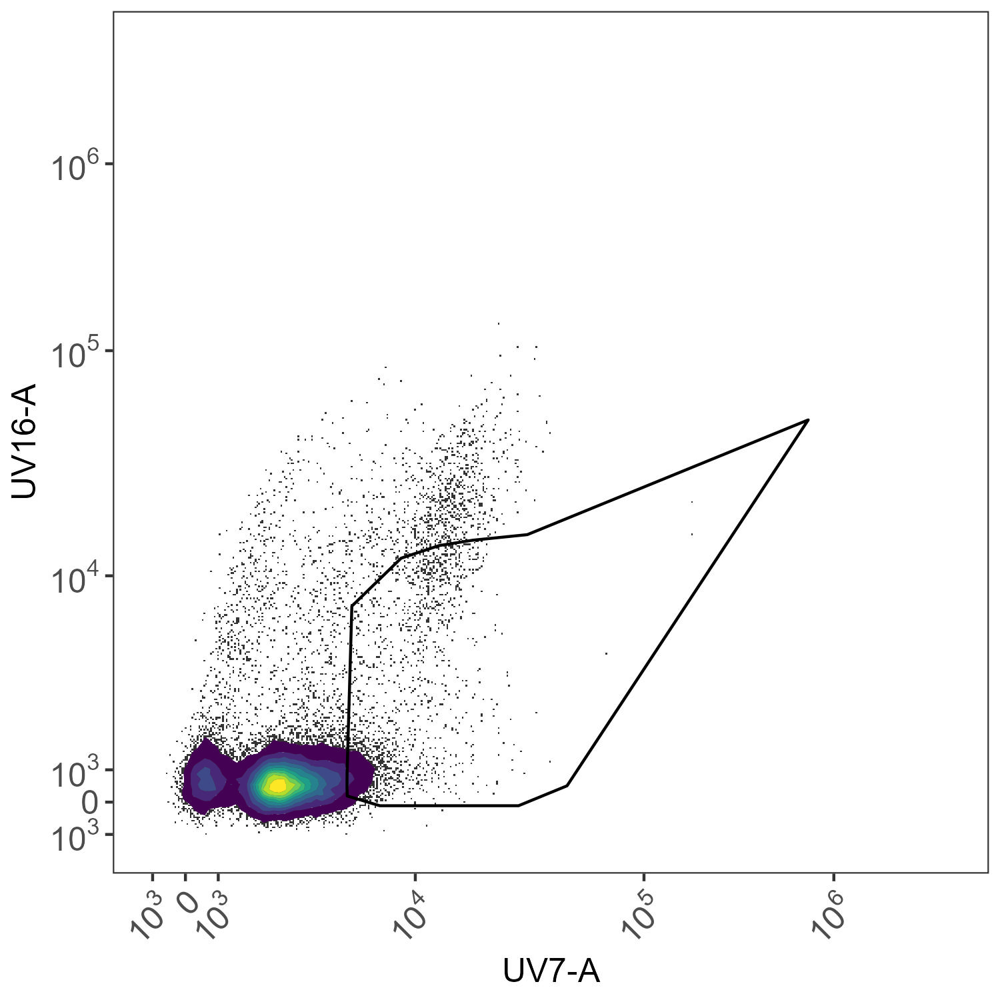
```


## Calculating the Fluorophore Spectra

Now we can isolate the spectra from the controls. By default, this uses the cleaned data if they are available. If you want to run a comparison, see the help for this function and set `use.clean.expr=FALSE` when running it.
```{r, eval=FALSE}
spectra <- get.fluorophore.spectra(flow.control, asp)
```
With this, we get plots of the spectra as traces and a heatmap. We also get a cosine similarity heatmap. You can check these, if you aren't familiar with what they should look like, against the expected profiles in online webtools. For the Aurora, check on [Cytek Cloud](https://cloud.cytekbio.com/). As of version 1.5.0, you should also get a pdf document showing you your fluorophore profiles in overlay compared to a reference standard for that fluorophore on the same instrument. Not all fluorophores will be available, particularly for the instruments I don't have regular access to, so if you want to contribute, visit the database and add your spectral profiles. See the Discussions page for more details on this.

Databases:

[Aurora](https://docs.google.com/spreadsheets/d/1ZagdBr_s_iW0Ogq9pT1Qvt1Tj0DEnapaV9xpLmiM3DY/edit?usp=sharing)

[FACSDiscover A8 and S8](https://docs.google.com/spreadsheets/d/1CtmD-sRMrBZ122QNSou76eASgGOEicS2GolEYL1TSdk/edit?usp=sharing)

[ID7000](https://docs.google.com/spreadsheets/d/1Q-t6EQMRrvEWRR2f4_rsEJaPuXN3N1gV-IOrhigEtKU/edit?usp=sharing)

[Opteon](https://docs.google.com/spreadsheets/d/1_FSy_iS_3vNvfC_jG5LIfwWgprcanXaV72szrwWYzJU/edit?usp=sharing)

[Mosaic](https://docs.google.com/spreadsheets/d/14eQNNMSv-JKXvxs7j7vze2KSMtBNFq1F8qba8G9DIYY/edit?usp=sharing)

[Xenith](https://docs.google.com/spreadsheets/d/1QMVE3ztsoiIuV-JJHN8xzXgTz-jou1fLtnljGRi1wC4/edit?usp=sharing)

[Symphony A5SE](https://docs.google.com/spreadsheets/d/1TQDjrfHgdbS6kn4JzgQa_P4M1q-wCWvVv_4tpVFleqA/edit?usp=sharing)


```{r, echo=FALSE, fig.cap="Spectral Signature Traces", fig.align="center"}
knitr::include_graphics("figures/Workflow/spectral_trace.jpg")
```


```{r, echo=FALSE, fig.cap="Spectral Signature Heatmap", fig.align="center"}
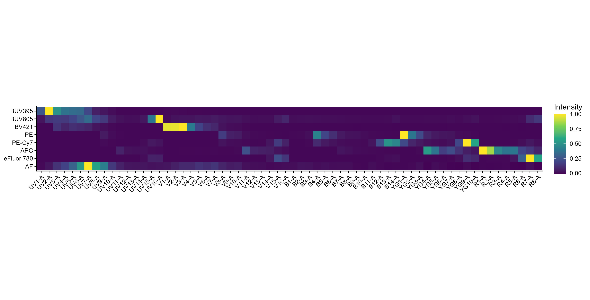
```


```{r, echo=FALSE, fig.cap="Cosine Similarity Heatmap", fig.align="center"}
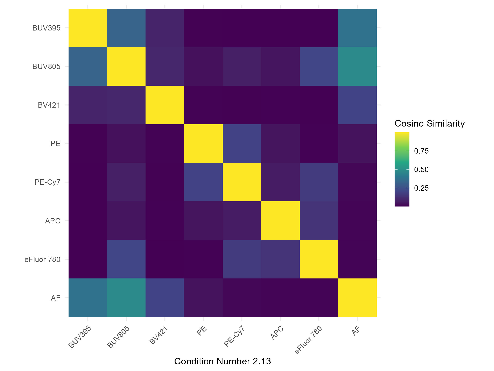
```

You also get a "Hotspot" matrix, as in the paper my Peter Mage et al.

```{r, echo=FALSE, fig.cap="Hotspot Matrix Heatmap", fig.align="center"}
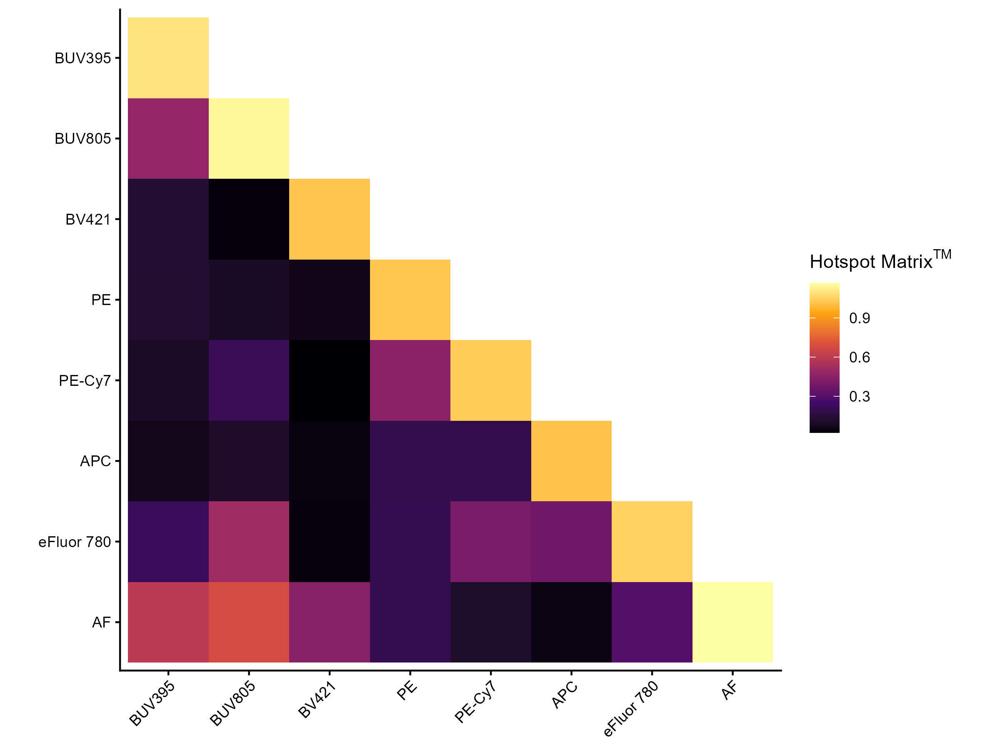
```

As per their [manuscript](https://pmc.ncbi.nlm.nih.gov/articles/PMC12139922/), we probably don't need to worry about anything under 4, may want to check stuff between 4-6, and should definitely look into values above 6. That said, this hotspot matrix will include the "AF" as if you were doing OLS unmixing, and that is not really relevant if you proceed with AutoSpectral unmixing of per-cell autofluorescence.

As of version 1.5.0, you should also get a pdf quality control report.

```{r, echo=FALSE, fig.cap="Spectral QC Report", fig.align="center"}
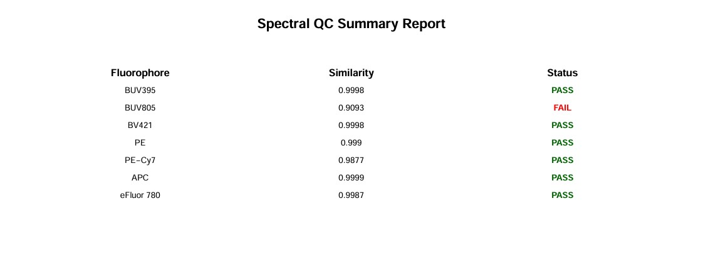
```

The BUV395 looks quite good:

```{r, echo=FALSE, fig.cap="Spectral QC BUV395", fig.align="center"}
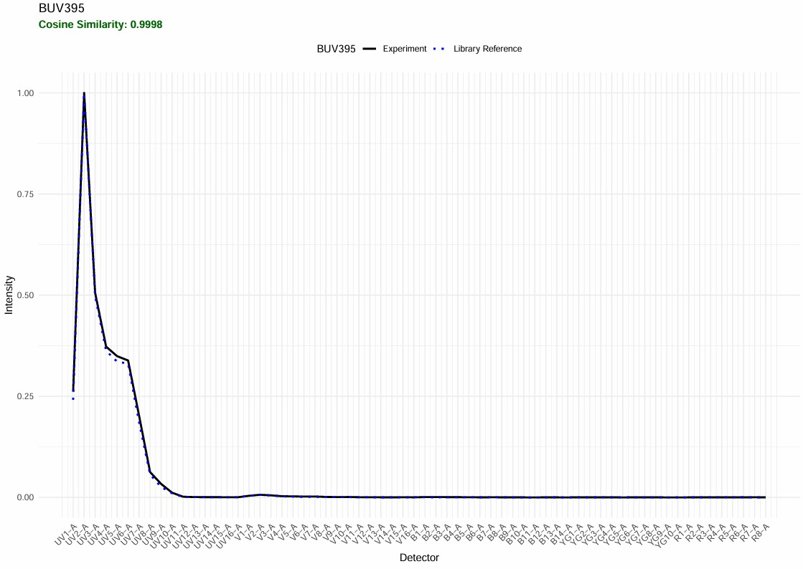
```

The BUV805 has "failed" QC. Let's have a look. This QC feature is new, so it will need to be adjusted and improved. In this case, it's flagging something worth looking at: the BUV805 spectrum in this experiment has an extra minor peak in the UV. That is autofluorescence because the BUV805+ cells are myeloid cells such as neutrophils and macrophages, and the scatter-matching for this population has not worked perfectly. Something for me to work on.

This will be fine.

```{r, echo=FALSE, fig.cap="Spectral QC BUV805", fig.align="center"}
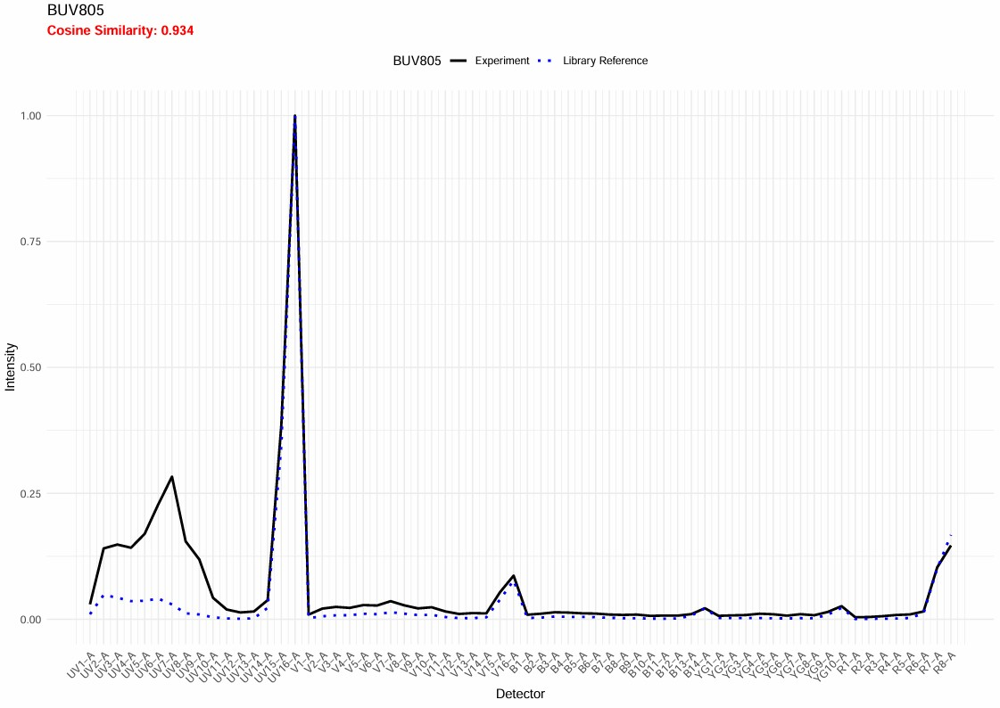
```

Scatter-matching plot for BUV805 from the control cleaning:

```{r, echo=FALSE, fig.cap="Scatter matching for the BUV805 control", fig.align="center"}
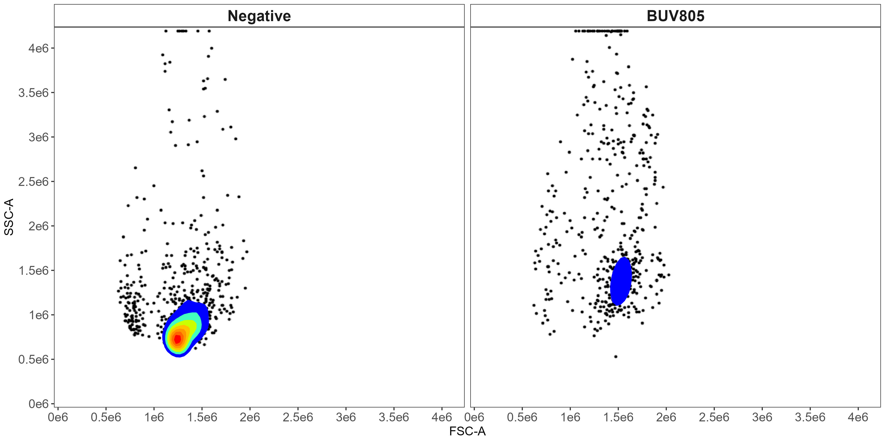
```

The spectra themselves are saved to a CSV file in the `table_spectra` folder. You can open CSV files as a spreadsheet in Excel and other programs.


# Unmixing

AutoSpectral provides options for unmixing. Let's start with the most basic, which is replicating the OLS unmixing as in SpectroFlo. Autofluorescence extraction with OLS and WLS unmixing in AutoSpectral is handled by including an "AF" signature in `spectra`. This is generated automatically from the unstained cell control sample that is tagged as "AF" in your `control.file`. We can use OLS or WLS without autofluorescence extraction by removing this row from the `spectra` matrix before we pass it to the unmixing call. Here are two easy ways to do that:

1) subset `spectra`
2) read in the CSV file in `table_spectra`, removing the AF channel

```{r, eval=FALSE}
rownames(spectra)
no.af.spectra <- spectra[ !(rownames(spectra) == "AF"),]
rownames(no.af.spectra)
no.af.spectra.2 <- read.spectra("Clean_autospectral_spectra.csv",
                                remove.af = TRUE)
rownames(no.af.spectra.2)
```

To unmix, specify the file (and path) of the FCS file you want to unmix:
```{r, eval=FALSE}
spleen.fcs.file <- "./Raw/Set1/Stained/D4 Spleen_Set1.fcs"
unmix.fcs(
  spleen.fcs.file,
  spectra, asp,
  flow.control,
  method = "OLS",
  file.suffix = "with AF extraction"
)
unmix.fcs(
  spleen.fcs.file,
  no.af.spectra,
  asp,
  flow.control,
  method = "OLS",
  file.suffix = "without AF extraction"
)
```
Note that this is just using OLS--this is not the "AutoSpectral" unmixing method, we are just using the AutoSpectral R package to perform bog standard unmixing.

If we have a folder full of FCS files, we can do all the files in the folder. Note that this is essentially just an `lapply` loop over the files. It can, however, be parallelized (set `parallel=TRUE`). Memory usage is handled via file chunking, which you can modify using the `chunk.size` argument, if needed.
```{r, eval=FALSE}
unmix.folder(
  fcs.dir = "./Raw/Set1/Stained/",
  spectra = spectra,
  asp = asp,
  flow.control = flow.control,
  method = "OLS", # use OLS unmixing (not AutoSpectral unmixing)
  parallel = TRUE,
  threads = 3
)
```
By default, the unmixed files are generated in `Autospectral_unmixed`, but you can change that by passing a path to `output.dir`.

If we want to use weighted least-squares, we call like this:
```{r, eval=FALSE}
unmix.fcs(spleen.fcs.file, spectra, asp, flow.control, method = "WLS")
```
The `method` is automatically appended to the output file name. If you wish to add something else to the file name, use the `file.suffix` argument.

More details on WLS unmmixing, including calculating and re-using weights will be detailed in a separate article later. Reach out if this is important to you now.

Okay, that's basic unmixing. And, I think you should see a bit of improvement using AutoSpectral even with the same unmixing algorithms due to the improvements in single-colour control handling. We do.


# Per-cell unmixing

## Per-cell Autofluorescence Extraction

For per-cell autofluorescence extraction and per-cell fluorophore optimization, AutoSpectral needs more information. We will extract autofluorescence signatures from the three tissues involved here, and look at how to use those in the unmixing. We'll also get information about the fluorophore emission variability and use that to try to improve the unmixing.

When we go to use this information in the unmixing, we select `method = AutoSpectral`.

As of version 1.0.0, per-cell autofluorescence extraction will be faster using `AutoSpectralRcpp`. On Windows, you will first need to install Rtools.

```{r, eval=FALSE}
devtools::install_github("DrCytometer/AutoSpectralRcpp")
```

Once `AutoSpectralRcpp` is installed, it takes over when the unmixing starts. You don't need to do anything else. It also helps out in a couple other computationally heavy spots, so you may experience faster processing elsewhere. There is no need for you to do anything--it will happen automatically once installed.

To use per-cell autofluorescence extraction only, no fluorophore optimization, do this:
```{r, eval=FALSE}
spleen.unstained <- "./Raw/Set1/Unstained/D1 Spleen_Set1.fcs"
spleen.af <- get.af.spectra(
  unstained.sample = spleen.unstained,
  asp = asp,
  spectra = spectra,
  refine = TRUE # optional; when TRUE, more AF spectra will be generated, focusing on problem cells. This takes longer, though.
)
unmix.fcs(
  fcs.file = spleen.fcs.file,
  spectra = spectra,
  asp = asp,
  flow.control = flow.control,
  method = "AutoSpectral", # use AutoSpectral unmixing
  af.spectra = spleen.af, # use these AF signatures as the options
  file.suffix = "per-cell AF extraction"
)
```

Using `refine=TRUE` will take longer, both during the `get.af.spectra()` call and during subsequent unmixing calls. The benefit of this is primarily in messier samples, particularly those from tissues. If you are just using PBMCs or nice lymphoid samples like spleen, you probably won't see much benefit from this. This is a situation where AutoSpectralRcpp helps out in the background, so be sure to install that for faster processing. This may be sped up further in the future.

We get the distribution of autofluorescence spectra as a spectral trace and as a heatmap in `figure_autofluorescence`. The AF spectra are saved as a CSV file in `table_spectra`.

```{r, echo=FALSE, fig.cap="Autofluorescence profiles in the spleen", fig.align="center"}
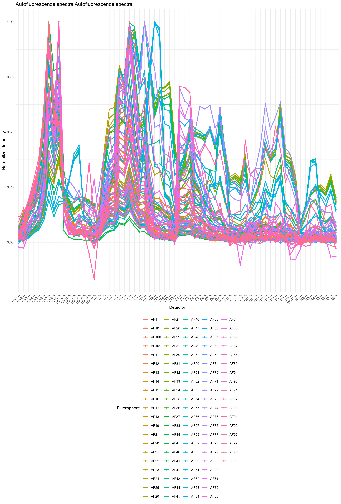
```

We can also look at the distribution of autofluorescence like this, where the black line represents a median signature (what you might use with an automated single AF parameter), and the red region represents the variation:

```{r, echo=FALSE, fig.cap="Autofluorescence variation in the spleen", fig.align="center"}
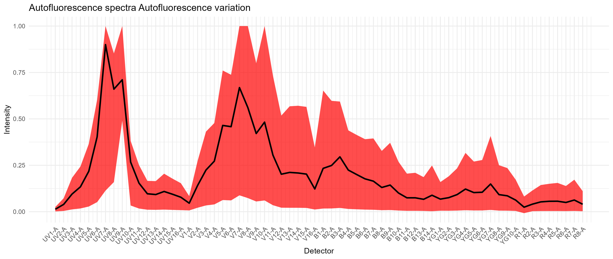
```


We also get images showing us the impact of the AF extraction on the unstained sample we have supplied.

This is without any AF extraction, looking at what AutoSpectral has determined are the two most-affected fluorophore channels:

```{r, echo=FALSE, fig.cap="Spleen: No AF Extraction", fig.align="center"}
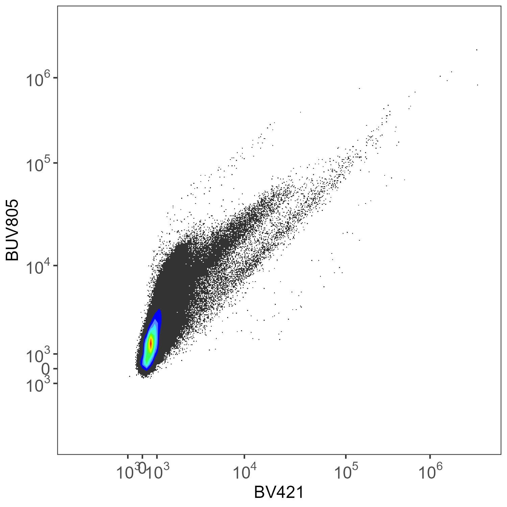
```

What you get on the same unstained sample with per-cell AF extraction, without refinement (refine=FALSE):

```{r, echo=FALSE, fig.cap="Spleen: Per-Cell AF Extraction", fig.align="center"}
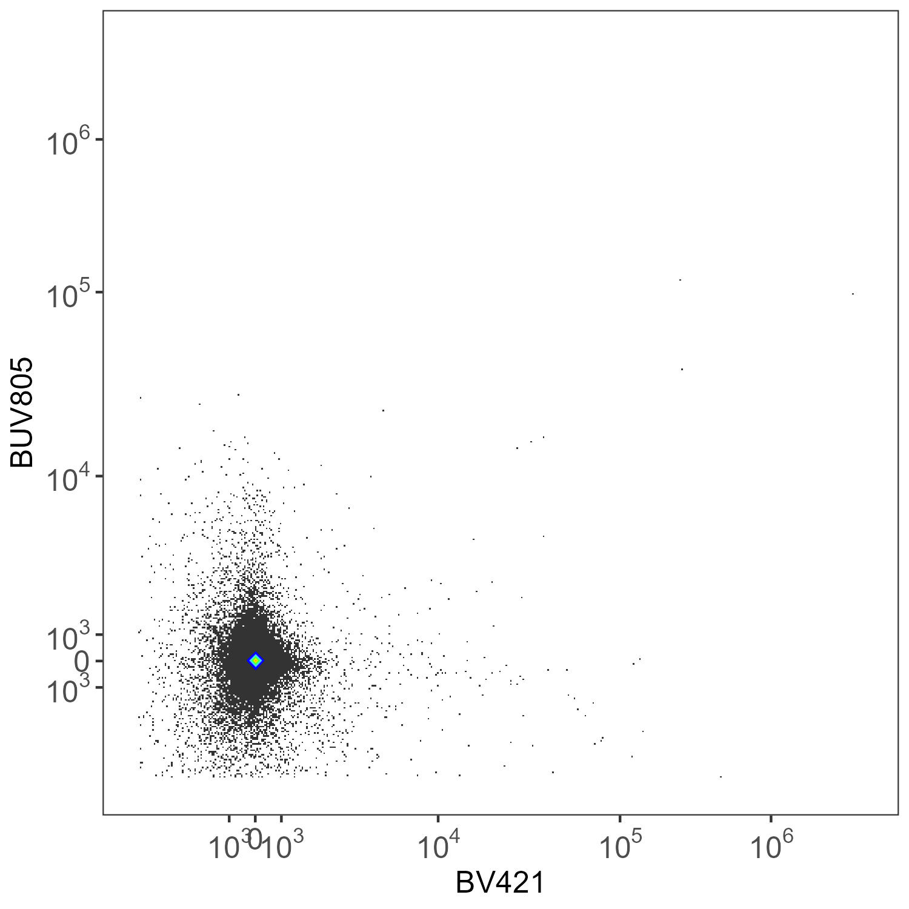
```

What you get on the same unstained sample with per-cell AF extraction, *with* refinement (refine=TRUE):

```{r, echo=FALSE, fig.cap="Spleen: Per-Cell AF Extraction Refined", fig.align="center"}
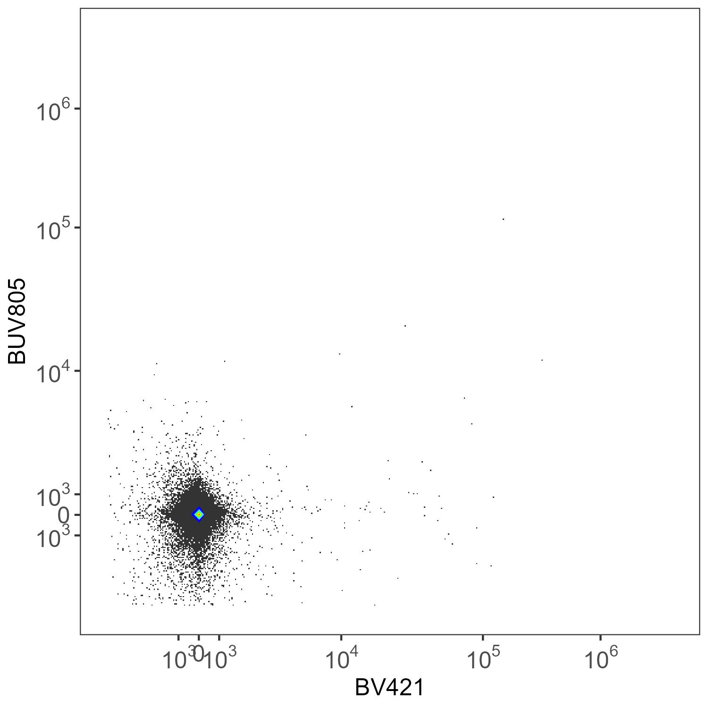
```


If you want to do this with samples containing different autofluorescence profiles, such as we have here, we extract the AF spectral variation from each type of unstained sample. We then provide the corresponding `af.spectra` to each unmixing call. The unmixing call can be to a single FCS file, or it can be, as above, to a folder. So, if you have a whole set of stained lung samples, you'd pull your AF spectra from the unstained lung sample, and then call `unmix.folder` on the folder containing your lung (and only lung) samples. Repeat for each type of autofluorescence sample.  Read more about how the per-cell autofluorescence extraction works in the [GitHub](https://drcytometer.github.io/AutoSpectral/articles/10_Single_Cell_AutoFluorescence.html) or [Colibri](https://www.colibri-cytometry.com/post/autospectral-single-cell-autofluorescence) article.

In this case, we have three types of samples: spleen, liver and lung tissues. If you are working with human PBMCs, usually a single (optionally pooled) unstained PBMC sample is fine. If, however, you have samples from very sick donors, you might consider collecting unstained sample from each donor and matching the autofluorescence more closely.

```{r, eval=FALSE}
lung.unstained <- "./Raw/Set1/Unstained/D2 Lung_Set1.fcs"
lung.af <- get.af.spectra(lung.unstained, asp, spectra) # use refine=TRUE for a modest improvement, default is FALSE
lung.fcs.file <- "./Raw/Set1/Stained/D5 Lung_Set1.fcs"
unmix.fcs(
  lung.fcs.file,
  spectra,
  asp,
  flow.control,
  method = "AutoSpectral",
  af.spectra = lung.af,
  file.suffix = "per-cell AF extraction"
)

liver.unstained <- "./Raw/Set1/Unstained/D3 Liver_Set1.fcs"
liver.af <- get.af.spectra(liver.unstained, asp, spectra) # use refine=TRUE for a modest improvement, default is FALSE
liver.fcs.file <- "./Raw/Set1/Stained/D6 Liver_Set1.fcs"
unmix.fcs(
  liver.fcs.file,
  spectra,
  asp,
  flow.control,
  method = "AutoSpectral",
  af.spectra = liver.af,
  file.suffix = "per-cell AF extraction"
)
```

You can easily set this up as a for loop or an lapply loop matching elements by names from a list.

For more detail on the per-cell AF extraction, see the [dedicated article](https://drcytometer.github.io/AutoSpectral/articles/10_Single_Cell_AutoFluorescence.html) on this subject.


## Per-cell Fluorophore Optimization

To do per-cell fluorophore optimization, we will first measure the variation in the spectrum for each fluorophore. For the unmixing, we'll supply the `af.spectra` and the `spectra.variants`, calling `AutoSpectral` unmixing. Read more about how the per-cell fluorophore optimization works in the [GitHub](https://drcytometer.github.io/AutoSpectral/articles/11_Per_Cell_Optimization.html) or [Colibri](https://www.colibri-cytometry.com/post/autospectral-per-cell-fluorophore-optimization) article.

We provide `spleen.af` as the `af.spectra` here because the control samples are from spleen. Provide whatever is the best fit for your single-stained controls. The point here is to match the AF of the controls so that we isolate the variation in the fluorophore signatures independent of any AF variation. 
```{r, eval=FALSE}
variants <- get.spectral.variants(
  control.dir = control.dir,
  control.def.file = control.file,
  asp = asp,
  spectra = spectra,
  af.spectra = spleen.af, # the AF relevant to any cell-based single-stained controls
  parallel = FALSE, # use parallel if TRUE
  refine = TRUE # optional; when TRUE, the variation will focus on more problematic cells--those that remain far from the ideal location after a first pass
)
```
The output of this is saved as an RDS file in folder `figure_spectral_variants`. You can load it back in using the `readRDS()` function in base R.

There are plots of the spectral variation for each fluorophore. For something like the CD11b-BUV805 in this data, the variation is largely changes in the autofluorescence because there are multiple cell types expressing CD11b. We also have variation in the long wavelength spillover on the violet and red laser, as should be expected from a tandem dye.

```{r, echo=FALSE, fig.cap="Variation in BUV805", fig.align="center"}
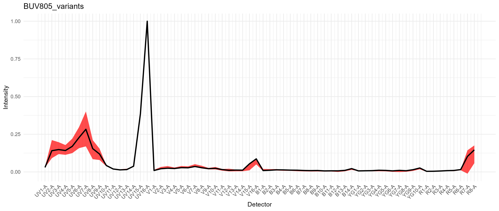
```

For PE-Cy7, we get a modest difference in the excitation between the blue and yellow-green lasers, which would cause spread if we had a fluorophore in that range on the blue laser, such as RB780. We don't in this case.

If we had tandem breakdown, we would probably see variability in the YG1-A detector.

```{r, echo=FALSE, fig.cap="Variation in PE-Cy7", fig.align="center"}
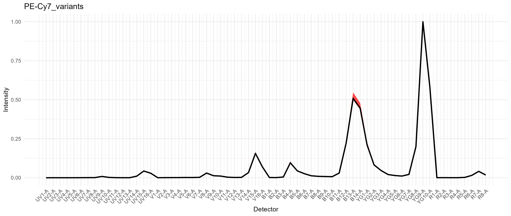
```

We can now pass this to the unmixing call. For quicker results, you may set the `speed` to `fast`, which checks fewer pre-screened variants per cell. This can be a bit slow if you have not installed `AutoSpectralRcpp`.
```{r, eval=FALSE}
unmix.fcs(
  lung.fcs.file,
  spectra,
  asp,
  flow.control,
  method = "AutoSpectral", # use AutoSpectral unmixing
  af.spectra = lung.af, # use this set of AF (matched to sample source)
  spectra.variants = variants, # by providing variants, we instruct the unmixing to perform per-cell fluorophore optimization
  file.suffix = "per-cell AF and fluorophore optimization",
  speed = "slow", # slow will be a bit better
  parallel = TRUE
)
```

Please note that if you are comparing the output FCS files from AutoSpectral to others you may have from the cytometer and you are doing this in FlowJo, FlowJo V10 is still terrible at handling scales. You must set the transformations on the axes to be the same for all coefficients in order to do a fair comparison. Otherwise you'll see whatever you've already done to tune your display (e.g., biexponential width basis) for your existing files versus some random default selection by FlowJo for AutoSpectral's files. Nothing to do with me.

For more detail on the per-cell fluorophore optimization, see the [dedicated article](https://drcytometer.github.io/AutoSpectral/articles/11_Per_Cell_Optimization.html) on this subject.


# Plotting

You can do a comparison using the plotting functions in AutoSpectral, but a dedicated flow cytometry analysis program with a graphical interface will be better. More on plotting on the dedicated article on [GitHub](https://drcytometer.github.io/AutoSpectral/articles/13_Plotting.html) or [Colibri](https://www.colibri-cytometry.com/post/autospectral-plotting).

```{r, eval=FALSE}
autospectral.unmixed.lung <- "AutoSpectral_unmixed/D5 Lung_Set1 AutoSpectral per-cell AF and fluorophore optimization.fcs"
spectroflo.unmixed.lung <- "./Unmixed/Set1/Stained/D5 Lung_Set1.fcs"

# using native AutoSpectral reader here (see `flowstate`)
asp.lung <- AutoSpectral::readFCS(autospectral.unmixed.lung)
sf.lung <- AutoSpectral::readFCS(spectroflo.unmixed.lung)

create.biplot(sf.lung, "BUV395-A", "BV421-A", asp, title = "SpectroFlo")
create.biplot(asp.lung, "BUV395-A", "BV421-A", asp, title = "AutoSpectral")

```

Let's have a look at the unmixed data.

```{r, echo=FALSE, fig.cap="SpectroFlo Unmixed", fig.align="center"}
knitr::include_graphics("figures/Workflow/SpectroFlo.jpg")
```

```{r, echo=FALSE, fig.cap="AutoSpectral Unmixed", fig.align="center"}
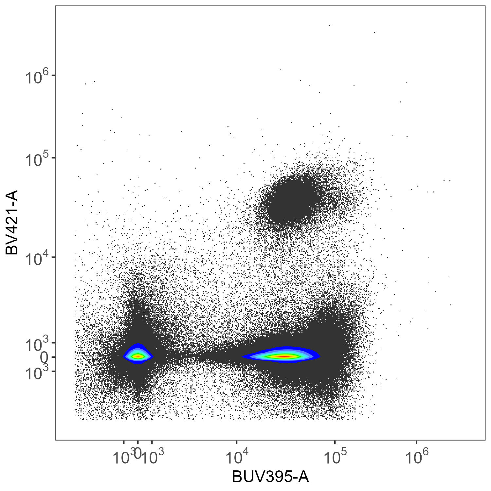
```

Here we have CD45-BUV395 and CD4-BV421. There really shouldn't be much of anything low for CD4 in the mouse. This is ungated data, so we're seeing everything, without any clean-up.

The original unmixing only uses a single autofluorescence parameter. As mentioned at the beginning of this post, you can use multiple autofluorescence to achieve better results in SpectroFlo with this small panel as it has been designed to accommodate that. There is no one solution for that approach, though.


Also, the plots shown here have hard cut-offs on the x and y axes, determined by arguments to create.biplot(). That can be modified, of course, but as stated, you're better off doing that in dedicated flow analysis software.


