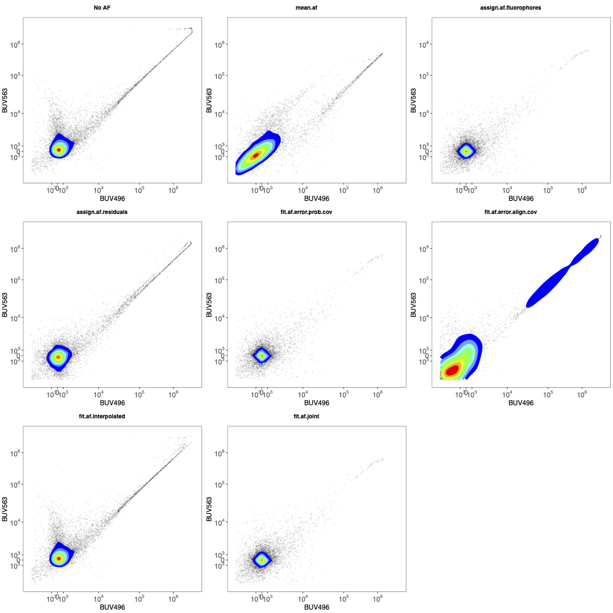
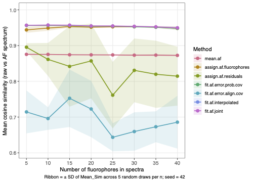

```{r setup, include=FALSE}
knitr::opts_chunk$set(echo = TRUE)
```

## Installation

Developments can be deployed and tested in `dev` branch.
To install the `dev` branch:

```{r dev branch, eval=FALSE}
devtools::install_github("DrCytometer/AutoSpectral@dev")
```

To replace this with the (hopefully) stable version, run this:

```{r master branch, eval=FALSE}
remove.packages("AutoSpectral")
devtools::install_github("DrCytometer/AutoSpectral")
```


## In progress

Here's some stuff that's in progress. These changes will show up first in the development `dev` branch, which you are welcome to install and test.

If you would like to contribute to AutoSpectral, these are key areas I have identified where it has shortcomings or needs improvement. Suggestions for strategies, or better, code suggestions, would be appreciated.

* Unmixing with controls from different days or different voltages
 + AutoSpectral does not currently support this, although it may work reasonably well anyway since these modern spectral cytometers are fairly well calibrated for PMT/APD linearity.
 + In most cases, AutoSpectral does not have access to the information needed to normalize the files between different voltage settings. For Cytek instruments, this would be QC information and the initial linearity response curve for the APDs. For FACSDiscover systems, this is likely the QSPE values, which are in the FCS files.
 + I'd need to sit down and work out the normalization functions. This hasn't been a top priority.

* More flexibility in negative/unstained samples.

* Allow multiple controls per fluorophore.

* Fix the issue causing discontinuities.
  + Progress has been made on this in v1.0.0 via the new, sped-up optimization strategy.
  + Additional improvements include better decontamination of AF from the spectral variants, which was causing cells to be pushed further away from the threshold for optimization, and a rduction in low-level noise introduced into the spectral variants due to fluctuations in electronic noise or autofluorescence. Any signal in the variant spectrum in a channel where the optimized single spectrum has less than 5% of the peak detector signal is now regularized towards the optimized spectrum. This focuses the variation on the "peaks", which is what causes the unmixing errors and spread.
  + This should be eliminated entirely with the next round of updates, tentatively 1.6.0. This uses a variance-covariance matrix plus residual alignment to determine optimal per-cell fluorophore spectra, without the requirement to use the TRU-OLS trick of dropping into a "positive-fluorophore only" unmixed space. That trick is highly effective, since it gives us much more information about the shape of the residual, but inevitably surfaces optimization artefacts around the positivity threshold.
  
* Better correction of unmixing errors
  + There are several strategies I'm investigating to handling the cases where the multi-color samples contain obvious errors outside the range of variation seen in the single-color controls. This is not stuff I'm going to put online, so get in touch if you'd like to work on this. 
  + This should be improved further with the next round of updates, tentatively 1.6.0
  
* Autofluorescence modeling
 +infer more precise AF spectra through geometric mapping to multiple points on the SOM. I tried this using weighted averages of how much each AF "helped" or "fit" the cell, but the result was worse. Probably I did something wrong because conceptually this make sense to me.

* Faster AF assignment through machine learning
 + Run a representative or pooled sample, figure out which AF spectrum belongs to each cell, train a model, use the model for lightweight (quick) approximation of the best spectrum for remaining samples. This is how I anticipate AutoSpectral could be employed on cell sorters. That said,
the Honeychrome implementation in Python uses a 3D matrix multiplication and is quite fast,
so this may not be necessary.
  


## Understanding Per-Cell Unmixing in AutoSpectral

This section provides an overview of the mathematical and biological ideas
underpinning the per-cell unmixing approaches in AutoSpectral, aimed at readers
with backgrounds ranging from wet-lab cytometry through to computational
biology. The two main components are per-cell autofluorescence (AF) assignment
and per-cell fluorophore spectral variant selection. Both solve the same
fundamental problem—choosing the best spectral model for an individual
cell—but they differ in what varies and why.

### The core problem: one model, many cells

Standard spectral unmixing applies a fixed linear model to every cell in a
sample. Each fluorophore is represented by a single spectral signature (a
normalised vector of detector intensities), and the observed raw detector
signal for any cell is assumed to be a non-negative weighted sum of those
signatures plus autofluorescence. In matrix form, if **X** is the (cells ×
detectors) raw data matrix and **S** is the (fluorophores × detectors) spectral
matrix, the unmixed fluorophore abundances **U** are estimated by ordinary
least squares (OLS):

$$\hat{\mathbf{U}} = \mathbf{X} \mathbf{S}^\top (\mathbf{S}\mathbf{S}^\top)^{-1}$$

The problem is that neither the fluorophores nor the autofluorescence are
perfectly fixed quantities. Tandem dyes degrade at varying rates; conjugation
efficiency probably varies within a batch; cells from different tissues carry
spectrally distinct populations of autofluorescent molecules. When any of
these deviate from the fixed spectral assumption, the residuals—the part of
the raw signal the model cannot explain—are non-random. They are correlated
with whatever is misspecified. AutoSpectral addresses this by replacing the
single fixed spectrum, for both AF and fluorophores, with a library of closely
related variants, and selecting the best variant for each cell.

---

## Autofluorescence Assignment Methods

Autofluorescence is typically the most pressing source of per-cell model
misspecification, particularly in complex tissue samples. Lung macrophages,
hepatocytes, eosinophils and neurons each carry a distinct mixture of
endogenous fluorescent molecules—NAD(P)H, flavins, porphyrins, lipofuscin—with
different excitation/emission properties. When cells from different tissue
compartments or different physiological states are present in the same sample,
no single AF spectrum adequately describes all of them. AutoSpectral's
`get.af.spectra()` function addresses this by training a SOM on the unstained
control and treating each SOM node centroid as a candidate AF spectrum. The
result is a library of up to 100 (default 10×10 SOM) variants covering the
breadth of AF variation present in the sample.

The remaining challenge is to decide, for each cell in the fully stained
sample, which of these variants is the most appropriate. AutoSpectral provides
several strategies for this assignment step, each with different assumptions
and failure modes. The function `benchmark.af.spectra()` (described later in
this article) is the recommended way to compare them on your own data.

### Why collinearity is key, and why the residual is not the AF

Before comparing the assignment strategies, let's clarify what AF actually does
to unmixing.

The key insight is that only the component of AF that is collinear with the
fluorophore spectral space propagates into the unmixed values. To see why,
consider the OLS solution. If the true raw signal for a cell is
\(\mathbf{x}_i = \mathbf{u}_i \mathbf{S} + \alpha_i \mathbf{a} + \pmb{\varepsilon}_i\),
where \(\alpha_i \mathbf{a}\) is the cell's AF contribution, then OLS unmixing
without an AF row in **S** will absorb the projection of \(\alpha_i \mathbf{a}\)
onto the fluorophore subspace into \(\hat{\mathbf{u}}_i\), and leave only the
component orthogonal to that subspace in the residual. The orthogonal component
of \(\mathbf{a}\), the part that is genuinely distinct from all fluorophore
spectra, does *not* affect the unmixed fluorophore values at all, because OLS
cannot represent it as a linear combination of the rows of **S**. It simply
sits in the residual. AF that is perfectly orthogonal to the fluorophore
subspace is therefore harmless from an unmixing perspective: it creates an
elevated residual norm, but it does not bias any fluorophore channel. In
contrast, AF signal that lies in the fluorophore subspace, i.e., that can be
expressed as a weighted sum of fluorophore spectra, is indistinguishable from
real fluorophore signal and will be assigned to whichever fluorophore
channel(s) it most resembles.

This has an important practical consequence: **unmixing the OLS residual
per-cell as if it were AF, then trying to correct the unmixed values
accordingly, does nothing mathematically.** The residual by construction is
orthogonal to the column space of **S**. Adding any multiple of the residual
back to the raw data and re-unmixing produces exactly the same \(\hat{\mathbf{u}}_i\),
because OLS projects out the orthogonal component before computing the
coefficients. The only AF signal that can be recovered this way is the part
that was never affecting unmixing in the first place. To correct for AF
contamination of the fluorophore channels you must either include an AF
spectrum (or basis) directly in **S** so the unmixing can explicitly account
for it, or subtract a scaled AF spectrum from the raw data before unmixing—
both of which require knowing which AF spectrum to use, hence the assignment
problem.

### From a biologist's perspective

Think of the different AF assignment strategies as different ways of answering
the question: "given everything I can see about this cell, what kind of
autofluorescence is it likely to have?"

The simplest possible answer is "the average"—every cell gets assigned the
mean AF spectrum. This is the baseline, and the question is always how much
better we can do.

Beyond that, each strategy uses a different piece of information:

- **Residual alignment** looks at what is "left over" after a preliminary
  unmix without AF. If a lot of signal remains in the channels where a
  particular AF variant is bright, that variant is probably a good match for
  this cell.
- **Fluorophore spillover minimisation** takes the opposite angle: it asks
  which AF variant, when subtracted from the raw signal, leaves the smallest
  apparent fluorophore signal in channels that should be empty. This is
  motivated by the fact that if you pick the wrong AF spectrum, the residual
  AF signal gets absorbed into the fluorophore channels it most resembles,
  creating false positive or elevated readings. This is obviously correct for 
  an unstained sample, where we have no fluorophore signals. For stained samples,
  this metric is correct because we are using fixed AF profiles, not free-ranging,
  so the AF can only propagate through the unmixing matrix according to the 
  variance-covariance matrix. That is, any sum of signals that can be reduced by
  the AF through the unmixing matrix is plausible.
- **Joint covariance-residual scoring** combines both signals: it rewards
  variants that reduce both the raw residual and the fluorophore spillover,
  and it weights fluorophore channels by how much AF variation actually
  propagates into them.
- **Component-based AF removal (PCA/SVD)** characterises the AF subspace
  from the unstained control using principal components rather than a single
  spectrum, and projects that subspace out of the single-colour control data
  before the fluorophore spectrum is fitted. This is used during spectrum
  extraction rather than per-cell assignment. An extension matches the
  projected AF contribution to the SOM library by cosine similarity, avoiding
  the spread that can arise from directly unmixing components that are
  collinear with fluorophore signals.
- **Scatter-matched assignment** is based on the biological intuition that
  cells of similar size and granularity—similar FSC and SSC—probably have
  similar autofluorescence. It finds the nearest neighbours of each test cell
  in scatter space from a reference unstained sample, averages their spectral
  signals, and uses that average as the cell's expected AF.

### From a mathematical perspective

All of the assignment approaches can be understood as approximate solutions to
a selection problem with the following structure. Let \(\mathbf{x}_i\) be the
raw detector signal for cell \(i\) (a row of **X**), and let
\(\mathbf{a}_1, \ldots, \mathbf{a}_K\) be the \(K\) candidate AF spectra (rows of
`af.spectra`). The AF index \(j^*\) we want is:

$$j^* = \underset{j}{\arg\min} \; \mathcal{L}(\mathbf{x}_i, j)$$

where \(\mathcal{L}\) is some loss function. The methods differ in their choice
of \(\mathcal{L}\).

**Residual alignment (`assign.af.residuals`)** computes a preliminary OLS
unmix of \(\mathbf{x}_i\) using only the fluorophore matrix **S** (no AF row),
obtaining \(\hat{\mathbf{u}}_i = \mathbf{x}_i \mathbf{S}^\top (\mathbf{S}\mathbf{S}^\top)^{-1}\).
The residual is \(\mathbf{r}_i = \mathbf{x}_i - \hat{\mathbf{u}}_i \mathbf{S}\).
Each AF variant is scored by the dot product \(\mathbf{r}_i \cdot \mathbf{a}_j\),
i.e. the projection of the residual onto that variant's spectral direction. This is
equivalent to asking which variant best accounts for the unexplained signal,
and maximising the dot product is equivalent to minimising the L2 residual
after subtracting that variant. The computation is very fast (a single matrix
multiply after the initial OLS), but the residual is meaningful only if the
preliminary unmix without AF is reasonable—it is not when the AF spectrum
overlaps heavily with the fluorophore space, because then the unmixing absorbs
AF signal into the fluorophore channels before the residual is even computed.
In other words, residual alignment works well when the panel is small and the
AF has distinctive spectral features that are poorly explained by the
fluorophores, but degrades in large panels where the AF is largely spanned by
the fluorophore basis.

**Fluorophore spillover minimisation (`assign.af.fluorophores`)** works in the
opposite direction. For each candidate AF variant \(j\), it estimates the scalar
AF intensity for cell \(i\) by projecting the cell's raw signal onto the
component of \(\mathbf{a}_j\) that is orthogonal to the fluorophore subspace.
Specifically, the orthogonal complement of \(\mathbf{a}_j\) in the fluorophore
subspace is

$$\mathbf{r}_j = \mathbf{a}_j - \mathbf{S}^\top (\mathbf{S}\mathbf{S}^\top)^{-1} \mathbf{S} \mathbf{a}_j$$

and the estimated AF scalar is \(k_{ij} = (\mathbf{x}_i \cdot \mathbf{r}_j) / \|\mathbf{r}_j\|^2\).
After subtracting \(k_{ij} \mathbf{a}_j\) from the raw signal, the residual is
re-unmixed and the fluorophore channels are summed in absolute value (L1 norm)
to give the loss. The idea is that subtracting the correct AF variant should
bring apparent fluorophore signals in "empty" channels close to zero. This
approach uses only the component of AF that the fluorophore matrix cannot
explain to estimate AF intensity, which means it is blind to AF signal that is
collinear with the fluorophores—the very situation where it matters most. As
panel size grows and the fluorophore basis more completely spans the spectral
space, the orthogonal residual \(\mathbf{r}_j\) shrinks, and the method's AF
intensity estimates become unreliable. The fluorophore spillover cost, however,
remains informative because it sees the net effect on the downstream unmixed
values. This method therefore tends to complement residual alignment: it is
more reliable in larger panels and degrades gracefully in smaller ones.

**Joint covariance-residual scoring (`assign.af.joint.cov`)** aims to combine
the strengths of both. The covariance matrix of the AF library \(\Sigma_{\rm AF}\)
is propagated into fluorophore space via the unmixing matrix **U**:

$$\Sigma_F = \mathbf{U} \Sigma_{\rm AF} \mathbf{U}^\top$$

The diagonal of \(\Sigma_F\) gives the per-fluorophore-channel variance induced
by AF spectral variation. Taking its square root yields a weight vector
\(\mathbf{w}\) that is large for fluorophore channels where different AF
variants have very different effects and small for channels where the variants
look alike. These weights modulate the L1 fluorophore error:

$$e^{\rm fluor}_{ij} = \sum_f w_f \left| [\hat{\mathbf{u}}_i - k_{ij} \mathbf{v}_j]_f \right|$$

where \(\mathbf{v}_j = \mathbf{U} \mathbf{a}_j\) is the fluorophore-space
projection of variant \(j\). The residual-space error is computed separately as
the L2 norm of the adjusted raw-space residual. The two proportional errors
(each expressed relative to the no-AF baseline) are multiplied together:

$$\mathcal{L}_{ij} = \frac{e^{\rm fluor}_{ij}}{e^{\rm fluor}_{i, \rm base}} \times \frac{e^{\rm resid}_{ij}}{e^{\rm resid}_{i, \rm base}}$$

Multiplying rather than adding the two terms means that a variant must reduce
*both* the fluorophore spillover and the raw-space residual in order to score
well—large improvements on one axis cannot fully compensate for poor
performance on the other. The covariance weighting naturally focuses the
fluorophore term on channels where the AF library is most discriminative, which
is precisely where the choice of variant matters most. This approach is
theoretically sound across a wider range of panel sizes, but it is also more
expensive to compute and is sensitive to the quality of the AF library (a
poorly constructed SOM that has converged to redundant nodes dilutes the
covariance weighting). It is currently the default in `benchmark.af.spectra()`
alongside the simpler methods.

**Component-based AF removal via principal components** is a qualitatively
different approach that addresses the collinearity problem directly. Rather
than selecting a single AF spectrum from a library and subtracting it,
this method characterises the AF subspace from the unstained control using
a (truncated) SVD, then projects that subspace out of the single-colour control
data before fitting the fluorophore spectrum. Concretely, the top four right
singular vectors of the (cells × detectors) unstained matrix are retained as
`af.pcs` (a 4 × detectors matrix). For cell-based single-colour controls,
the positive events are unmixed against the combined matrix `rbind(af.pcs,
original.spectrum)`, yielding per-cell weights for both the AF principal
components and the fluorophore itself. The weighted contribution of the AF
components is then back-projected into detector space and subtracted, producing
AF-decontaminated events from which the optimised fluorophore spectrum is
derived.

The advantage is that the AF subspace basis is data-driven and
multi-dimensional: it can represent structured AF variation (e.g., multiple
cell populations with different AF profiles) without requiring the user to
specify the number or shape of AF components explicitly. The limitation is
that this approach can drive unmixing-dependent spread in the same way standard
multiple AF extraction does. So, it is used during *spectrum extraction* in the 
controls, not during *per-cell assignment* in the fully stained sample—it refines
what goes into the spectral library, rather than selecting a per-cell AF variant
at unmixing time.

An extension under development addresses this limitation. After back-projecting
the AF principal components for each positive cell, the projected vector can
be compared against the SOM-derived AF library by cosine similarity, and the
closest library variant can be flagged as that cell's likely AF type. This
sidesteps the spread introduced by directly unmixing collinear components:
instead of estimating AF abundance from a potentially ill-conditioned solve,
the projection is used only to *navigate to* the nearest spectral variant,
and then the standard library-based assignment and subtraction pipeline takes
over. This combination is most effective in small panels where the AF
components are not heavily collinear with the fluorophore spectra, and becomes
progressively less reliable as panel dimensionality grows because the unmixing
spread noise conflates the estimates of the true AF signal.

**Scatter-matched assignment (`assign.af.scatter.match`)** is implemented as an
experimental benchmarking alternative rather than a production method. For each
test cell, the \(k\) nearest neighbours in the reference unstained sample are
located in scatter space (FSC, SSC) using the `FNN` library, and their spectral
channels are averaged to produce a cell-specific AF estimate. If `af.spectra`
is provided, the closest library variant to this scatter-matched average is
returned as the assignment. The biological motivation is strong—cells of
similar size and granularity should have similar endogenous fluorophore
content—but the method requires a well-matched unstained reference acquired in
the same run, is sensitive to scatter normalisation, and does not generalise to
the case where AF variation is driven by factors other than size (e.g.,
metabolic state or activation).

### Method summary

| Method | Key information used | Strength | Weakness |
|---|---|---|---|
| `assign.af.residuals` | Raw-space unexplained signal | Fast; works well for small panels with distinctive AF | Residual is confounded when AF overlaps with fluorophore space |
| `assign.af.fluorophores` | Fluorophore spillover after AF subtraction | Robust in large panels | Blind to collinear AF; AF intensity estimate degrades when orthogonal residual is small |
| `assign.af.joint.cov` | Both, covariance-weighted | Broadly robust; discriminative weights | More expensive; requires good SOM coverage |
| Component-based (SVD/PCA) | Data-driven AF subspace from unstained SVD | Multi-dimensional; no need to pre-specify AF shape; used in spectrum extraction | Applied at control-fitting stage, not per-cell assignment; collinearity risk in large panels; projection-to-SOM-library variant still experimental |
| `assign.af.scatter.match` | Scatter-matched unstained neighbours | Biologically motivated | Requires matched unstained reference; sensitive to scatter normalisation |

For a useful discussion of the consequences of choosing the wrong spectrum
on unmixing accuracy—framed in terms of covariance propagation—see
[this post on the Colibri Cytometry blog](https://www.colibri-cytometry.com/post/predicting-unmixing-errors).

### Comparing and benchmarking AF methods

If you are developing a new AF assignment function or simply want to compare
the existing strategies on your own data, AutoSpectral provides three
functions: `compare.af()`, `test.af.accuracy()`, and
`benchmark.af.spectra.size()`.

**`compare.af()`** evaluates multiple sets of AF spectra—for instance,
candidates produced by `get.af.spectra()` with different `som.dim` values or
`refine` settings—against a single unstained FCS file, using a fixed assignment
function. For each candidate it computes per-cell cosine similarity between
the raw detector signal and the assigned AF spectrum. A common mean-AF
baseline (every cell assigned to the mean of the first candidate) is included
as a reference point. The result is a bar chart saved to `plot.dir` and a
named list of similarity statistics.

```{r compare-af-example, eval=FALSE}
# compare two different AF extractions (e.g. with and without refinement)
af_v1 <- get.af.spectra( unstained.fcs, asp, spectra, refine = FALSE )
af_v2 <- get.af.spectra( unstained.fcs, asp, spectra, refine = TRUE )

cmp <- compare.af(
  unstained.fcs   = unstained.fcs,
  spectra         = spectra,
  af.spectra.list = list( no_refine = af_v1, refined = af_v2 ),
  assign.fn       = "assign.af.joint.cov",
  n.downsample    = 2000,
  plot.dir        = "figures/af_compare"
)

# mean cosine similarity for each candidate
sapply( cmp[ c("no_refine","refined") ], `[[`, "Mean_Sim" )
```

**`test.af.accuracy()`** evaluates one or more assignment *functions* against
a fixed set of AF spectra on a single unstained file. Use this first when
developing a new method, to confirm it works and to benchmark it against the
existing approaches.

Your function must follow one of two calling conventions.

**Assign-type** functions take `(raw.data, spectra, af.spectra)` and return
an integer vector of per-cell AF-spectrum indices (one index per row of
`raw.data`, values in `1:nrow(af.spectra)`).

```{r assign-type-skeleton, eval=FALSE}
my.assign.af <- function( raw.data, spectra, af.spectra ) {
  # raw.data   : matrix, cells x detectors
  # spectra    : matrix, fluorophores x detectors (no AF row)
  # af.spectra : matrix, AF variants x detectors

  # ... your logic here ...

  af.idx  # integer vector, length nrow(raw.data), values in 1:nrow(af.spectra)
}
```

**Fit-type** functions (name must start with `"fit."`) receive pre-computed
OLS quantities and return both the assignments and the unmixed fluorophore
values. They are called with
`(raw.data, unmixed, unmixing.matrix, spectra, af.spectra)` and must return a
list with elements `$unmixed` (cells × fluorophores matrix, no AF column) and
`$af.idx` (integer vector as above).

```{r fit-type-skeleton, eval=FALSE}
fit.my.af <- function( raw.data, unmixed, unmixing.matrix, spectra, af.spectra ) {
  # unmixed         : matrix, cells x fluorophores (OLS result without AF)
  # unmixing.matrix : matrix, fluorophores x detectors

  # ... your logic here ...

  list(
    unmixed = unmixed_with_af_corrected,  # cells x fluorophores, no AF column
    af.idx  = af.idx                      # integer vector
  )
}
```

The naming convention matters: `test.af.accuracy()` dispatches on whether the
function name starts with `"fit."`, so make sure your function is named
accordingly and is available in the current search path (loaded via
`devtools::load_all()` or `source()`).

```{r test-af-accuracy, eval=FALSE}
results <- test.af.accuracy(
  unstained.fcs = "path/to/unstained.fcs",
  spectra       = my.spectra,      # fluorophores x detectors
  af.spectra    = my.af.spectra,   # AF variants x detectors
  asp           = my.asp,
  functions     = c(
    "assign.af.fluorophores",  # existing method - keep as a reference point
    "assign.af.residuals",     # existing method
    "my.assign.af"             # your new function
  ),
  n.downsample  = 1000,        # events per run; increase for a final check
  plot.dir      = "figures/af_dev"
)

# mean cosine similarity for each method (higher is better)
sapply( results, `[[`, "Mean_Sim" )

# per-cell similarities for your method
hist( results[["my.assign.af"]]$Similarity, breaks = 50,
      main = "Per-cell cosine similarity", xlab = "Cosine similarity" )
```


```{r, echo=FALSE, fig.cap="AF Accuracy", fig.align="center"}

```

**`benchmark.af.spectra.size()`** is the panel-size sensitivity test. Once
your function looks promising on a single file, use this to check whether it
holds up as the panel grows. It repeatedly subsamples the spectra matrix to a
range of panel sizes and runs `test.af.accuracy()` for each subsample,
producing a summary line plot of mean cosine similarity vs. fluorophore count.
A well-behaved method should sit above the mean-AF baseline across all panel
sizes. Methods that degrade steeply with panel size are likely being confounded
by collinearity between the AF library and the expanding fluorophore basis.

```{r benchmark-af-spectra-size, eval=FALSE}
bench <- benchmark.af.spectra.size(
  unstained.fcs = "path/to/unstained.fcs",
  spectra       = my.spectra,
  af.spectra    = my.af.spectra,
  asp           = my.asp,
  functions     = c(
    "assign.af.fluorophores",
    "assign.af.residuals",
    "my.assign.af"
  ),
  n.fluors     = c( 5, 10, 20, 30, 40 ),  # panel sizes to test
  n.draws      = 5,                        # random draws per panel size
  n.downsample = 1000,
  plot.dir     = "figures/af_dev"
)

# the summary data frame: mean and SD of cosine similarity across draws
head( bench$summary )

# the ggplot object, if you want to tweak the figure
bench$plot + ggplot2::ggtitle( "My new AF method" )
```

The output plot shows one line per method with a ribbon spanning ±1 SD across
random draws. You should expect `assign.af.residuals` to perform well at small
panel sizes and degrade relative to `assign.af.fluorophores` as the panel
grows; `assign.af.joint.cov` should be competitive at all sizes. If you have
results you'd like to share, feel free to open an issue or pull request on
GitHub with the summary data frame and the benchmark plot.


```{r, echo=FALSE, fig.cap="AF Benchmarking", fig.align="center"}

```

---

## Understanding Per-Cell Fluorophore Spectral Variant Selection

### From a biologist's perspective

Think of a tandem dye such as BUV661 as a molecular relay: a UV-excited donor
(BUV395) passes energy to a red-emitting acceptor (something like Cy5). The
efficiency of that relay is not identical on every antibody molecule in the
vial. Some molecules are fully intact; some have partially degraded linkers;
the distribution of species depends on the batch, the storage conditions, and
the length of time since conjugation. When 80 antibody molecules are bound to
a cell, the mix of intact and partially broken conjugates on that cell
determines its spectral profile. No two cells will have exactly the same mix,
so we get a distribution of spectral shapes at the population level even from a
nominally pure staining reagent. This is one of the root causes of spillover
spread.

AutoSpectral captures this variation by first running a SOM on the
single-colour control for each fluorophore (selecting the brightest events so
that AF does not contaminate the picture), yielding a library of up to ~100
variant spectra per fluorophore. During unmixing of the fully stained sample,
the best variant from each fluorophore's library is selected for each
individual cell. The selection is guided by the residuals: if subtracting a
particular variant leaves less unexplained signal—or equivalently, the
predicted spectrum better fills the raw data—it scores better. Because testing
every combination of variants across all fluorophores would be combinatorially
prohibitive, AutoSpectral pre-screens candidates for each fluorophore
individually, using the residual shape to identify variants that push in the
correct direction, and then only tests the top few candidates (1 in "fast"
mode, up to all of them in "slow" mode).

### From a mathematical perspective

The OLS unmixing model for a single cell is:

$$\mathbf{x}_i = \mathbf{u}_i \mathbf{S} + \pmb{\varepsilon}_i$$

where \(\mathbf{u}_i\) is the (1 × *F*) row of fluorophore abundances and
**S** is the (*F* × *D*) spectral matrix. If the true spectrum for fluorophore
\(f\) on cell \(i\) is \(\mathbf{s}_{f,i}\) rather than the library spectrum
\(\mathbf{s}_f\), then the model is misspecified by
\(\Delta\mathbf{s}_f = \mathbf{s}_{f,i} - \mathbf{s}_f\), and the residual for
that cell will contain a component \(u_{fi} \Delta\mathbf{s}_f\). The pre-screening
step exploits this: for each fluorophore \(f\) and each variant \(v\) in its SOM
library, the difference \(\Delta\mathbf{s}_{fv} = \mathbf{s}_{fv} - \mathbf{s}_f\)
is computed. If the inner product \(\mathbf{r}_i \cdot \Delta\mathbf{s}_{fv}\) is
positive, the residual is correlated with the direction in which this variant
differs from the base spectrum—evidence that the variant may improve the fit.
Only variants with positive alignment are retained as candidates, which
typically reduces the candidate set from \(O(100)\) to \(O(1)\)–\(O(3)\) without
meaningfully affecting the selected variant. The final winner is chosen by
full OLS re-unmixing using the candidate variant in place of the base spectrum
and selecting the variant that minimises the overall residual sum of squares.

The residual pre-screening step is implemented in C++ in `AutoSpectralRcpp`
and runs at speeds comparable to standard OLS unmixing. The quality of the
result depends on the quality of the single-colour control SOM: if the control
contains significant AF contamination, or if too few events were acquired in
the peak region, the variant library will not accurately represent the true
spectral distribution of the fluorophore, and variant selection will provide
limited benefit. The version 1.0.0 improvements to AF decontamination of the
variant extraction step (`get.spectral.variants()`) are designed to address
this.

Note that the per-cell fluorophore variant selection and the per-cell AF
assignment are complementary rather than sequential. Both run during the
`unmix.fcs()` call when `af.spectra` and `spectra.variants` are both provided.
The AF assignment is performed first (establishing the AF component for each
cell), and the fluorophore variant selection then refines the remaining
fluorophore channels. Errors in the AF assignment propagate into the fluorophore
residuals and may slightly bias the variant selection; this is one motivation
for investing in a good AF extraction before running per-cell fluorophore
optimization.


---

## Per-Cell Unmixing as a Continuous Optimization Problem

### What AutoSpectral currently does

The per-cell variant selection approach described above is, at its core, a
**coordinate descent** strategy. We have a joint objective—find the spectral
model (AF variant plus one variant per fluorophore) that best explains each
cell's raw detector signal—but rather than optimizing over all variables
simultaneously, we hold all but one fixed and optimize that one, then cycle
through the variables in sequence. In AutoSpectral's implementation, AF
assignment is resolved first, then each fluorophore's variant is selected
independently given the current model for everything else. One pass through
all variables constitutes one iteration, and in the current implementation a
single pass is performed.

This strategy has a well-understood theoretical basis. When the loss function
is separable—meaning the contribution of each component to the total residual
depends only weakly on the values of the others—coordinate descent converges
rapidly to a good solution, often in a single sweep. In the spectral unmixing
context, separability holds approximately when the fluorophores are
well-resolved: if BV421 and BV510 have very different spectral signatures,
choosing the best BV421 variant has little effect on how well the BV510
residual is explained, and vice versa. The approximation degrades as panel
complexity increases and spectral signatures begin to overlap more heavily.

For the fluorophore side, the pre-screening step (retaining only variants
whose residual alignment is positive) can be understood as a **majorisation-
minimisation** or **surrogate optimisation** step: rather than evaluating the
full OLS cost for every candidate, we compute a cheap linear proxy (the inner
product \(\mathbf{r}_i \cdot \Delta\mathbf{s}_{fv}\)) that upper-bounds the
true residual improvement, and discard candidates that cannot improve the
objective. This is the same idea that underlies the MM algorithm and
expectation-maximisation: replace the true objective with a tractable surrogate,
optimize the surrogate, and iterate. Here we do not iterate—the surrogate is
used only to prune the candidate set before a single exact evaluation—but the
mathematical justification is identical.

Cell-specific can be the Poisson IRLS implementation in `unmix.poisson.fast()`.
In the Poisson model, the variance of each detector measurement is assumed proportional to its mean (i.e., photon-counting noise), so the effective weight for detector \(d\) in cell
\(i\) is \(w_{id} \propto 1/\mu_{id}\), where \(\mu_{id}\) is the predicted
signal. This is probably the correct noise model for photomultiplier and APD detectors
in the photon-limited regime, and it down-weights high-signal detectors that
are dominated by shot noise rather than by model misspecification. The Poisson
IRLS solver iterates this weighting to convergence and is implemented in C++ in
`AutoSpectralRcpp` for speed; see `unmix.poisson.fast()` for usage.

Standard WLS, in contrast, uses one set of weights for all cells. We don't usually
have access to the detector noise readings that would make for optimal weights,
so AutoSpectral uses an empirical estimate based on the mean signal in the data.
More on this in the WLS article.

AutoSpectral unmixing does not, as of this writing, use WLS for cell-specific
spectral optimization. A single set of weights does not, empirically, appear to
produce better unmixing, likely because the metric in AutoSpectral already
effectively optimizes for the same net effect. Using cell-specific weights without
IRLS refinement of those weights introduces noise, because each individual cell's
measurements are noisy. IRLS is costly to compute, but perhaps a kNN approach to
select similar cells and use that average as weights would be effective.

### Directions for future development

The current approach leaves a lot on the table.

**Iterative joint coordinate descent.** Running multiple passes of AF
assignment and fluorophore variant selection—with each pass re-using the
updated model from the previous one—would allow the AF and fluorophore
estimates to converge jointly rather than being fixed after a single sweep.
This is most likely to matter for samples with heavy AF–fluorophore
collinearity, where errors in AF assignment distort the fluorophore residuals
and errors in fluorophore variant selection distort the AF residual in the
opposite direction. A convergence criterion based on the fraction of cells
changing their assigned variant between sweeps would make it straightforward
to terminate early when the solution is stable. This is being implemented in 1.6.0.

**Continuous spectral parameterisation.** The current approach selects a
spectrum from a discrete library. An alternative is to parameterise the
fluorophore spectrum as a continuous function of one or more latent variables
(e.g., a one-dimensional degradation axis for tandems, or a two-dimensional
excitation × emission shift for environmental-sensitivity dyes) and optimise
the latent variable directly for each cell using gradient-based methods. The
SOM codebook would provide initialisation points, and the gradient of the OLS
residual with respect to the latent variable is straightforward to compute.
This would eliminate the quantisation artefacts that arise when a cell's true
spectrum lies between two SOM nodes, at the cost of requiring a differentiable
spectral model. It is difficult to do this without allowing the entire model to
go haywire.

**Bayesian formulation.** The variant selection problem is naturally expressed
as Bayesian inference: the prior over AF and fluorophore variants encodes what
is known from the single-colour controls, and the likelihood is the OLS or
Poisson residual. A Markov chain Monte Carlo (MCMC) sampler would explore the
joint posterior over all variant assignments simultaneously, correctly
propagating uncertainty rather than returning a single point estimate. This
would make it possible to quantify, for each cell, how confident the model is
in its spectral assignment and to flag cells for which multiple assignments
are nearly equally plausible. The main practical obstacle is speed: even a
very efficient MCMC scheme would be orders of magnitude slower than the current
coordinate descent approach for datasets of millions of cells.

**Variational inference.** Variational autoencoders (VAEs) and related
amortised inference approaches offer a middle ground between point estimation
and full MCMC. The encoder network maps a cell's raw detector signal to a
distribution over a low-dimensional latent space (representing AF type,
fluorophore degradation states, and cell-to-cell biological variation), and
the decoder reconstructs the expected raw signal from the latent
representation. End-to-end training on large unlabelled datasets of raw FCS
files could in principle learn spectral variation structure that the current
SOM-based approach misses—including correlations between fluorophores arising
from cell biology rather than spectral physics. A trained VAE would also
support fast amortised inference: the encoder forward pass is a single neural
network evaluation per cell, comparable in speed to OLS. The limitation is
that VAEs require large training sets and careful regularisation to avoid
collapsing the latent space, and the learned representation may not generalise
across cytometer configurations. A physics-informed architecture that
constrains the decoder to the known linear spectral model would mitigate the
latter concern, and is an active area of research in single-cell methods more
broadly (e.g., CytoVI). VAEs also run on tensorflow, typically, so this would
be better implemented in Python.

If any of these directions interest you, please get in touch via GitHub.
