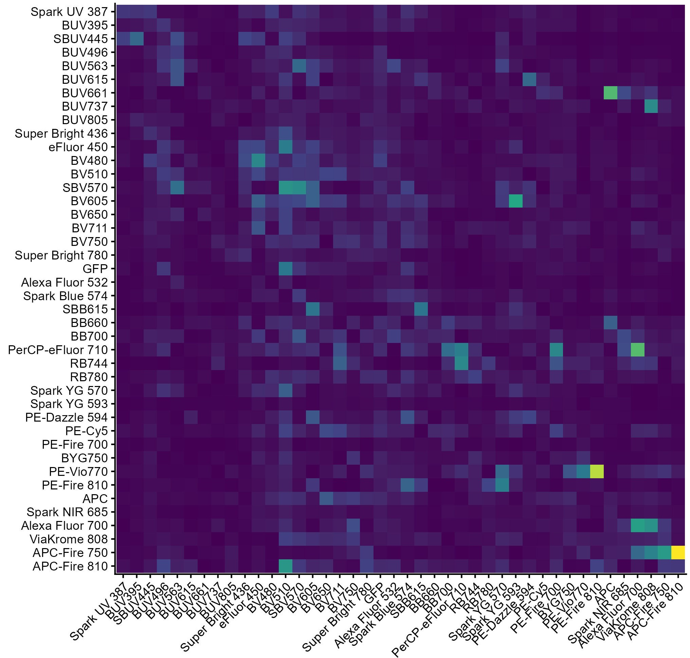

```{r setup, include=FALSE}
knitr::opts_chunk$set(echo = TRUE)
```

## Predicting and correcting unmixing errors 

One key problem in spectral cytometry is what to do when the unmixing isn’t correct. Oftentimes this means that the controls weren’t a good match for the sample, and better controls a probably the best solution. See BioLegend beads, Slingshot aka Spectracomp beads, CD45 bispecific binding or just good old cells for options. Mathematically, however, it should be possible to account for low levels of mismatch between the control and the sample, adapting the unmixing to adjust for this. 

The current implementation of AutoSpectral does not provide “adaptive” unmixing. It only uses variation found in the single-stained controls to reduce how that variation propagates through the unmixing matrix. Ozette’s Resolve approach is meant to adapt to the sample, as I understand it, correcting unmixing errors even if that error cannot be captured exactly by the distribution of information in the controls. (At the time of writing this, I have not viewed their webinars or used Ozette Resolve, so this may not be correct. I may update this later, but wanted to write this beforehand so I make clear I’m not just learning it from Ozette.) 

Why is adaptive unmixing useful? Let’s consider an example of tandem breakdown. We stain with something like PE-Cy7, we have a single-stained control and some multi-color samples. Let’s suppose we make our control quickly using beads, chucked it in the fridge, then spent an hour making our master mix for the samples on the bench in the light. We now have a big discrepancy in light exposure, which will result in differential tandem breakdown between the control and the samples. Specifically, we will get more breakdown on the samples, so more PE-like signal. If we have PE as well as PE-Cy7 in our panel, we will get unmixing error, skewing the PE-Cy7+ cells towards PE. (For tips on tandem handling, see this article.) Adaptive unmixing picks up on this, in theory, noting properties of the sample’s data that differ from the control with respect to PE-Cy7 and PE, adjusting the likely spectral profile(s) for PE-Cy7 to compensate. Working correctly, we would probably determine that many of the cells were more likely to be PE-Cy7+PE- than PE-Cy7+PE+, reversing the skew.  

Working out how to do this is a bit tricky because we don’t have a ton of information to go on. In this example, there is undeniably more PE signal because we have created more PE without the Cy7 attached. It’s just that some of the PE was originally PE-Cy7. Most experienced cytometrists could probably tell you from looking at a plot of this data that there’s tandem breakdown going on, though, so the information is there. Visually, we are relying on patterns in the data, correlations between the PE-Cy7 and PE levels. We are using the relationship between multiple points, not just individual points. And that is one approach that can be used to adapt. We can impose priors on the data, suggesting that features such as hypernegative events or correlations (those skews) are likely to be wrong. This allows us to identify what would be required to correct those events back to where the “should” be. My talk at 2025’s Babraham Spectral Symposium included an approach to this effect, so it is possible, just tricky.

One of the difficult parts of determining a more accurate set of unmixed measurements for each cell is that there is quite a bit of noise in the raw data measurements. The instruments produce electronic noise, which we can think of as a ground level hum. Then we have autofluorescence, which adds a layer of background chatter, mostly fairly low, but varied. Finally, we have the signals from the fluorophores themselves, which go into multiple detectors at fairly high levels, but in relatively predictable patterns. All of these elements are variable, and that variation gets projected through the unmixing matrix, producing uncertainty and error in our unmixed data values. To get more accurate readings, we need to identify the sources of error, characterize them, and guess at how much each contributes to an individual cell’s raw measurements, disentangling that to all of the potential sources. Since an individual cell’s measurements are so noisy, we could, in theory, get more robust estimates of the noise using aggregate measurements, using tools such as k-nearest neighbors. At this point, though, the unmixing becomes non-deterministic and is more in the realm of dimensionality reduction. 

At present, there are a couple of ways this noise is dealt with in certain unmixing approaches already available. Weighted least squares allows you to take individual detector noise levels into account, effectively saying that some of the raw measurements are more reliable than others. Poisson unmixing takes this a step further: it adapts to each cell, determining a unique set of weights for each cell based on the magnitude of signals in that cell (more signal = more noise from spillover). Multiple autofluorescence extraction can be considered as a type of noise reduction—we allow the autofluorescence signals to spread out over multiple unmixed parameters, aiming to capture variability in those allocated channels rather than in the fluorophore channels. AutoSpectral measures the variability in both autofluorescence and fluorophore output, and it aims to pin down some of that variability on a per-cell basis. 

Circling back to our question of adaptive unmixing, what can we do without imposing prior assumptions on the data or turning the unmixing into a dimensionality reduction? Well, we actually do have some important clues as to what can cause a sample not to match the controls. The locations of the errors are quite predictable from the data we can get from the single-stained controls. Our PE-Cy7 can produce an error against PE, but it should never produce one directly against BUV395, with which it shares no overlap in detector signal. So, collinearity (e.g., cosine similarity) is involved. I am going to suggest, however, that the key is to consider the similarity between the variability in Fluorophore A versus the profile of Fluorophore B. Where do we get variability in our PE-tandems? In the PE region (from tandem breakdown), in the direct laser excitation of the tandem element (say red laser exciting Cy7 weakly), and in the echoes of that across other laser excitation lines. The variance (or standard deviation, or covariance if you want to be fancy) of the fluorophore (and autofluorescence) emissions propagates as error through the unmixing matrix. We can take the variation in spectral signature, as produced by AutoSpectral here, and consider this a map of where we will have problems for a given fluorophore. Compiling all the similarity values for fluorophore variability versus other fluorophore signatures allows us to make a heatmap for a panel like this: 

```{r, echo=FALSE, fig.cap="Covariance Matrix", fig.align="center"}

```

Notice how we get a hotspot for BUV661 versus APC. In this panel, there is a lot of spillover spread (uncertainty) from BUV661 into APC (but not the other way around). We also get a peak for PE-Vio770 into RB780—that’s the blue laser excitation of PE-Vio770 (like PE-Cy7) interfering with RB780 measurements. A very good reason to use the new dyes. There is generally a lot of uncertainty around 500nm in the violet, where I have intentionally overloaded the panel to trigger unmixing errors with respect to autofluorescence. 

This error propagation matrix isn’t a new concept, as far as I can work out. It appears to be well known in statistics. I’m also blundering around in the dark here on my own, so I may be wrong. 

Now, if we know where we’re going to get errors based on our existing controls, we also know where we’re probably going to get errors if those controls aren’t a good match for our samples. Same spots. Once we can predict, we can correct. One quite simple way of doing this starts by extracting the main components of variation from the measurements of variability for a given fluorophore (e.g., using PCA or SVD). This will tell us how the fluorophore wants to vary. We can use those error/variation components in an unmixing matrix to pull out information on a per-cell basis telling us which direction each cell wants to move along those problematic vectors. That tells us how much correction should be applied to each cell. The problem with doing this naively, of course, is that the error components are definitely going to be collinear with the other fluorophores (because that’s the variation we care about), so we immediately hit unmixing spread due to a poorly conditioned matrix. So, we can’t use the information directly to correct our unmixing because it amplifies other sources of noise. We can, however, use it to calculate adjustments to the original input variation measurements for the fluorophore output. That gets around the spreading noise. We effectively learn the adjustments to the distribution from the sample(s). 

As an example of that process, I have applied it to adjust one original distribution of autofluorescence profiles (from mouse lung) to something closer to what we’d actually get from mouse spleen. What I’ve done is cluster the unstained lung sample to get autofluorescence profiles using AutoSpectral’s get.af.spectra() function. I’ve then adapted those lung AF profiles to a spleen sample using PCA components of the original lung AF in the unmixing alongside the fluorophore signatures. Alongside this, we determine which is the best single AF spectrum for each cell, using AutoSpectral’s per-cell AF fitting. We then have two pieces of information about the AF per cell: 1) The projected component signals (noisy, but containing information from multiple signatures together) and 2) the “best fit” single profile. We can gather all cells with the same “best fit” profile, average their projected component signals (averaging out most noise), and update the current best fit with the mean projection. That shifts the distribution while retaining the discrete profiles that are useful for unmixing without introducing spread from collinearity. 

Anyway, this is fairly speculative still. 

